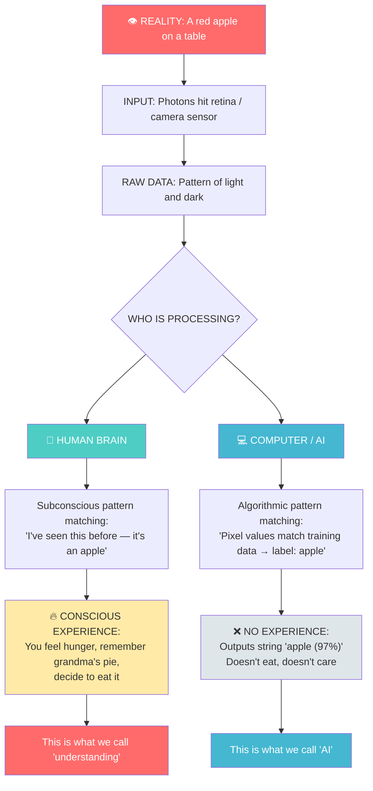

# Chapter 1: The Silicon Brain vs. The Human Mind

---

## Block 1: The Philosophical Hook

**"Do you know that you know?"**

Close your eyes. Imagine an apple. You can see its red curve, feel its smooth skin, imagine its crunch. Now — *how* did you do that? You didn't open a textbook. You didn't calculate anything. You just... knew.

This is the **Hard Problem of Consciousness** — the question philosophers have chased for centuries. How does a lump of biological tissue (your brain) produce thoughts, feelings, and the experience of being *you*?

Now imagine you're a computer. Someone shows you 10,000 photos of apples labeled "apple." You don't "see" red or feel smoothness. You see numbers — row after row of pixel values. And yet, somehow, you learn to say "that's an apple" with 99% accuracy.

The question of this book isn't "can machines think?" — it's **"what does 'think' even mean?"**

Welcome to the first chapter of your journey. By the time you finish this book, you won't just understand how computers see. You'll understand something deeper about how *you* see, too.

---

## Block 2: What We Need to Know (Zero-Math Core)

### The Three-Layer Model of Intelligence

Imagine a milkshake. Not the drink — the structure. A milkshake has three layers:

```
+------------------+
|  WHIPPED CREAM   |  <- Consciousness, self-awareness, "the feeling of being"
+------------------+
|   THE MILKSHAKE  |  <- Pattern recognition, learning, memory
+------------------+
|   THE GLASS      |  <- Raw data input (light, sound, touch)
+------------------+
```

**Layer 1 — The Glass (Input):** Your eyes capture photons. A camera captures photons. At this layer, you and a webcam are doing the same thing: converting light into signals.

**Layer 2 — The Milkshake (Patterns):** Your brain takes those signals and finds patterns. "That curved red shape? That's an apple." A computer does the same thing — it just calls it "classification" instead of "recognition."

**Layer 3 — The Whipped Cream (Consciousness):** You *experience* the apple. You feel hunger, nostalgia, or just mild annoyance that the apple is slightly bruised. The computer? It outputs a string: "apple (confidence: 0.97)." It doesn't *experience* anything.

**The Big Secret:** Modern AI lives entirely in Layer 2. It's incredible at pattern recognition. It has zero consciousness. Every "intelligent" thing a computer does is just a very, very advanced pattern-matching game.

### The "Chinese Room" Thought Experiment

Philosopher John Searle asked us to imagine a room. Inside, there's a person who doesn't speak a word of Chinese. They have a giant rulebook that says: "If you see squiggle A, write squiggle B." People outside slide Chinese messages under the door. The person follows the rules and slides back perfect Chinese responses.

To the outside world, the room speaks Chinese. But the person inside? They're just following rules. They don't understand a single word.

**This is every AI system today.** Including the ones we'll build in this book. They produce intelligent behavior without any understanding. That's not a bug — it's the whole point.

---

## Block 3: The Tech Lab (Code & Usage)

**Wait — code in a philosophy chapter?**

Yes. Your very first line of Python. Don't worry — it's one line. Think of it as dipping your toe in the water. We'll learn what all of it means in Chapter 3.

### Your First Python Program

Open Google Colab (don't have it yet? We'll set it up in Chapter 2 — for now, just read along). Type this into a code cell and press Shift+Enter:

```python
# This is your first line of Python code.
# It tells the computer to display a message on the screen.
# The word 'print' is a command that means "show this to me."
# The text inside quotes is the message itself.

print("Hello, silicon brain. I am your human teacher.")
```

**What happens:** The computer executes the `print` instruction. It takes the text between the quotes and displays it on your screen.

**Why this matters:** You just gave a command to a machine, and it obeyed. Every AI system works exactly like this — just with billions more instructions happening in sequence. You're not "coding." You're teaching.

### The Thought-Experiment Extension

Once that works, try this:

```python
# This asks a question and waits for your answer.
# 'input' is a command that pauses the program and listens to your keyboard.
# The variable 'response' is like a sticky note that stores whatever you type.

response = input("Do you think machines can be conscious? (yes/no): ")

# This checks what you wrote and prints a custom reply.
# 'if' is a decision command — it only runs the next line if the condition is true.

if response == "yes":
    print("Interesting! You might be a panpsychist.")
else:
    print("You and John Searle would get along.")
```

**What you just did:** You made the computer *react to your opinion*. This is the seed of every AI interaction — input, decision, output. That's all intelligence is, at the code level.

---

## Block 4: The Family Mirror

### How This Chapter Helps Your Father

Your father uses GPS navigation. Every time the GPS says "recalculating," it's doing exactly what we just did — taking input (your location), running a pattern-matching algorithm (finding the fastest route), and producing output (turn left in 200 meters). It doesn't "know" where you are. It just follows the rules.

### How This Chapter Helps Your Mother

Your mother's email spam filter? Same thing. It has a rulebook: "If the email contains 'free money' AND 'click here,' label it spam." It doesn't *understand* spam. It just recognizes patterns.

The entire AI industry — from self-driving cars to medical diagnosis — is just bigger, faster versions of the same input-pattern-output loop you just coded.

---

## Block 5: Cognitive Debugging (Issues & Solutions)

### The Mistake: "AI is alive."

**Why we make it:** We're human. We anthropomorphize everything. Your phone isn't "angry" when the battery dies. Your car isnt "tired." But we talk that way because it feels natural.

**The psychological fix:** Remember the Chinese Room. Every time you catch yourself thinking "the AI understands me," pause and think: "No — it has a very good rulebook." This is called **theory of mind calibration**, and it's the single most important mental habit you can develop as an AI engineer.

### The Mistake: "I need to be a genius to understand this."

**Why we make it:** Imposter syndrome. You see complex terms like "neural network" and assume it requires a PhD.

**The psychological fix:** Every concept in this book will be reduced to a story. If you can understand why a GPS says "recalculating," you can understand a neural network. They're the same idea, just bigger.

---

## Block 6: The AI Assistant Prompt

Copy and paste this into ChatGPT, Claude, or any AI assistant to practice this chapter interactively:

> You are a patient philosophy tutor for a college freshman who has ZERO background in AI. We just read Chapter 1 of "Eyes of the Machine" about the Chinese Room thought experiment and the difference between human consciousness and machine pattern-matching. Please:
> 1. Ask me 3 questions to check my understanding of the Chinese Room argument.
> 2. Give me 2 everyday examples (not from the book) of systems that seem intelligent but are really just following rules.
> 3. Challenge my answers like a friendly debate partner — don't just say "correct," push my thinking.
> 4. Keep your language simple. No jargon. No math.

---

## Block 7: The Brain-Tickler (Funny Exercise)

### The "Human Chinese Room" Challenge

For 24 hours, pretend you're the Chinese Room. Every time someone talks to you, mentally tell yourself: "I am receiving input. I will consult my rulebook. I will produce output." 

Then, at the end of the day, write a 3-sentence reflection on whether you felt less "conscious" doing this — or more aware of how much of your daily life *is* rule-following.

**Bonus:** Try this during a family dinner. When your mom asks "how was your day?" think: *Input received. Pattern match: "fine" is the standard output. Execute.* Then see how she reacts. (Warning: She might think you're being sarcastic. Explain you're doing "philosophical research.")

---

## Block 8: Visual Infographic Blueprint

Generate this infographic using Mermaid (or draw it by hand):



**Title:** "The Two Paths from Light to Label"
**Caption:** Both paths start with the same photons. Both end with "it's an apple." But only one path involves a mind that can enjoy the apple.

---

## Block 9: The Mentor's Feedback

You just finished Chapter 1.

If your brain feels a little scrambled right now — good. That's the feeling of a new mental framework being built. You didn't write much code, but you did something more important: you built the **mental container** that will hold everything else in this book.

Here's what you accomplished:
- You confronted the hardest question in philosophy of mind.
- You learned the Three-Layer Model of intelligence.
- You understood the Chinese Room and why AI isn't conscious.
- You wrote your first Python program (yes! that counts!).
- You started building the habit of **cognitive debugging** — questioning not just the code, but your own thinking.

The students who struggle with AI aren't the ones who can't handle math. They're the ones who never paused to ask "what am I actually building?"

You just asked that question. You're already ahead of 90% of beginners.

**Rest. Digest. When you're ready, say "PROCEED" and we'll set up your workshop.**

---

*— A.L Hossam A. Abdelwahab*
