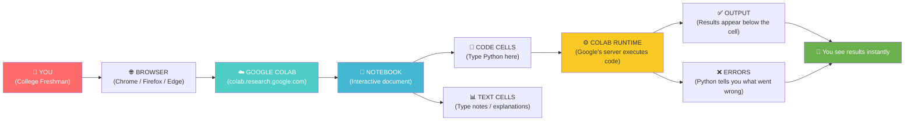

# Chapter 2: The Workshop

---

## Block 1: The Philosophical Hook

**"Where does thinking happen?"**

You wouldn't try to build a wooden chair in your bedroom carpet. You'd go to a workshop — a space with the right tools, good lighting, and a sturdy bench.

Programming is the same. You need a space where your thinking can happen. Not a physical space — a digital one. In the programming world, this is called a **development environment**.

But here's the philosophical twist: the workshop shapes the thinking. If your only tool is a hammer, everything looks like a nail. If your workshop is a mess of complicated installations, you'll spend all your energy just setting things up instead of *learning*.

This chapter is about choosing your workshop wisely — and why a clean, borrowed workshop is better for a beginner than a garage full of half-assembled tools.

---

## Block 2: What We Need to Know (Zero-Math Core)

### The "Borrowed Kitchen" Analogy

Imagine you want to bake a cake. You have two options:

**Option A — Your friend's kitchen (Google Colab):**
- Walk in. Everything is already there: oven, mixer, bowls, ingredients.
- You don't need to buy anything. You don't need to install anything.
- But — you're borrowing it. Your cake lives there while you bake it.
- If you walk away and come back tomorrow, your cake is still on the counter.

**Option B — Your own kitchen (Local setup):**
- You need to buy the oven, install it, wire it to the gas line.
- You need to buy every ingredient individually.
- It's yours forever. No borrowing. No restrictions.
- But — if the oven breaks, you're the repair person.

**Google Colab is the borrowed kitchen.** It's a free, pre-configured Python environment that runs in your browser. You don't install anything. You just open a link and start coding.

### What is Google Colab Exactly?

- A **Jupyter Notebook** (fancy term for an interactive coding document) hosted on Google's servers.
- It runs in your **browser** — nothing to install on your computer.
- It comes with **Python pre-installed**, along with hundreds of popular libraries (Pillow, OpenCV, matplotlib, numpy — all ready to go).
- It gives you a **free GPU** (yes, a graphics card) for when you need to train AI models later.
- Your work auto-saves to **Google Drive**.

### What About Local Setup?

Local means installing Python directly on your computer. You'd install Python from python.org, then use a tool called `pip` to add libraries one by one.

**For this book, we use Colab.** Why?
1. Zero setup time.
2. Zero "it works on my machine" problems.
3. Zero money spent.
4. The code in this book is tested on Colab — it will work for you exactly as written.
5. You can share your notebooks with a link.

---

## Block 3: The Tech Lab (Code & Usage)

### Part A: Your First Colab Notebook

Follow these steps:

1. Open your browser. Go to: **https://colab.research.google.com/**
2. Click **"New Notebook"** (bottom-left of the dialog).
3. You'll see a rectangle with a play button — that's a **code cell**.
4. Click inside it. Type:

```python
# This is a code cell in Google Colab.
# The brackets on the left [ ] show the cell's run order.
# Click the play button ▶ or press Shift+Enter to run this cell.

print("Hello from the cloud! This code is running on Google's computers, not mine.")
```

5. Press **Shift+Enter**. You should see the output appear below.

**Congratulations. You just ran code on a supercomputer in a Google data center — from your browser.**

### Part B: Installing a Library (Even Though Colab Has It)

In Colab, you install packages using `!pip install`. The `!` tells Colab "run this as a system command, not Python."

```python
# The exclamation mark ! means "run this in the terminal, not in Python."
# 'pip' is Python's package manager — it downloads and installs libraries.
# 'install' tells pip to add a library to this environment.
# opencv-python is the library we'll use for computer vision.
# Run this only once per Colab session.

!pip install opencv-python
```

When you run this, you'll see text scroll by — that's pip downloading and installing. When it's done, you'll see a message like "Successfully installed opencv-python-5.0.0.93."

**Note:** Colab actually comes with OpenCV pre-installed. But knowing how to install packages is essential — when you use libraries not included by default, this is how you add them.

### Part C: Checking Your Toolkit

Let's verify the environment is ready for this book:

```python
# Import checks: each line loads a library and prints its version.
# 'import' is Python's command to load a library into memory.
# The 'as' keyword gives the library a shorter nickname.
# The .__version__ attribute contains the version number.

import sys                          # 'sys' is a built-in library for system info.
print("Python version:", sys.version[:6])  # [:6] means "show only first 6 characters."

import cv2 as cv                    # 'cv2' is OpenCV's module name (kept for history).
print("OpenCV version:", cv.__version__)

import PIL                          # PIL = Python Imaging Library (Pillow).
print("Pillow version:", PIL.__version__)

import matplotlib as mpl            # For displaying images and charts.
print("Matplotlib version:", mpl.__version__)

import numpy as np                  # For working with numbers in grids (arrays).
print("NumPy version:", np.__version__)
```

**Expected output (versions may differ slightly):**
```
Python version: 3.12.13
OpenCV version: 5.0.0.93
Pillow version: 12.3.0
Matplotlib version: 3.11.0
NumPy version: 2.0.2
```

### Part D: Saving Your Work

Colab auto-saves to Google Drive if you connect it:

```python
# This mounts your Google Drive to this Colab notebook.
# A pop-up will ask you to sign in and grant permission.
# After granting, you'll see a folder called 'drive' in the file browser.

from google.colab import drive
drive.mount('/content/drive')

# Don't worry about understanding every line above.
# Just know: this connects your notebook to your Google Drive so you can save files.
```

### Part E: The "Hello, Computer Vision" Test

Let's create something visual:

```python
# Import matplotlib for drawing.
# matplotlib.pyplot is a collection of functions for creating visualizations.

import matplotlib.pyplot as plt

# Create a small image: a 50x50 red square.
# numpy.zeros makes a grid (array) filled with zeros.
# The shape (50, 50, 3) means: 50 rows, 50 columns, 3 color channels (Red, Green, Blue).
# 255 is the maximum value for a color channel (bright red).

red_square = np.zeros((50, 50, 3), dtype=np.uint8)  # 'dtype=np.uint8' means "store as integers 0-255."
red_square[:, :] = [255, 0, 0]                      # Set ALL pixels to Red=255, Green=0, Blue=0.

# Display the image.
# plt.imshow is the command to render a numpy array as a picture.
# It will show a solid red square — your first computer-generated image!

plt.imshow(red_square)
plt.title("My First AI Image (It's Just Red. That's Fine.)")
plt.axis('off')  # Hides the axis numbers so it looks like a clean image.
plt.show()
```

You just created a digital image from nothing but numbers. The red you see on screen is just an array of numbers that your screen interprets as "red." This is the foundation of everything we'll build.

---

## Block 4: The Family Mirror

### How This Chapter Helps Your Father

Your dad uses WhatsApp. He doesn't think about the servers, the encryption, the database. He opens the app and it works. **Colab is the same.** It's an app that works. He doesn't need to know that Google has a server farm in Belgium running his notebook. He just opens the link you send him and sees your code running.

### How This Chapter Helps Your Mother

Your mom uses Google Docs. She types a document, closes the laptop, and opens it later — everything is saved. **Colab notebooks work the same way.** They live on Google's servers so she never loses work. No "I forgot to save" panic.

**The lesson:** You're not learning "programming." You're learning to use a tool that works exactly like the apps your parents already trust. The only difference is, now you're the one giving the instructions instead of following them.

---

## Block 5: Cognitive Debugging (Issues & Solutions)

### The Mistake: "I installed Python locally but nothing works."

**Why it happens:** You found a tutorial that said "install Python on your computer," tried it, got a "not recognized" error, and now feel stuck.

**The fix:** Close that terminal. Open Colab. The problem isn't you — it's that local Python setup requires environment variables, PATH configuration, and a dozen tiny details that one wrong click breaks. Even experienced developers hit this. **That's why we use Colab for this book.** You're not taking the easy way out — you're being smart about where you spend your energy.

### The Mistake: "I closed the tab and my code is gone."

**Why it happens:** Colab notebooks auto-save, but only if they're saved to Google Drive or opened from Drive.

**The fix:** Before closing, check the title bar. If it says "Untitled notebook", go to File → Save a copy in Drive. From now on, always open Colab from **colab.research.google.com** and select the **"Open from Drive"** tab.

### The Mistake (Bonus): "The notebook is taking forever to run."

**Why it happens:** You might have connected to a GPU runtime, which takes longer to allocate.

**The fix:** For our first few chapters, we don't need a GPU. Go to Runtime → Change runtime type → set Hardware accelerator to **None** (not GPU or TPU). This makes Colab faster for basic coding.

---

## Block 6: The AI Assistant Prompt

Copy and paste this into any AI assistant:

> You are a friendly tech setup tutor for a college freshman who has never programmed. We just read Chapter 2 of "Eyes of the Machine" about Google Colab. Please:
> 1. Give me a step-by-step checklist to verify my Colab environment is ready (check Python version, import libraries, display an image).
> 2. Explain what Jupyter Notebook IS in one sentence using a kitchen analogy.
> 3. Tell me the ONE thing I should do before closing a Colab notebook to avoid losing work.
> 4. Give me a 30-second "panic button" fix if my notebook says "Runtime disconnected."
> 5. Keep your language at a 8th-grade reading level. No jargon.

---

## Block 7: The Brain-Tickler (Funny Exercise)

### The "Blind Date with Python" Challenge

Create a new Colab notebook. In one code cell, write the following WITHOUT looking at the chapter (test your memory):

```python
# Write a line of code that prints any message.
# Write a line that imports matplotlib.
# Write a line that creates a 10x10 blue square.
# Write a line that displays it.
```

Stuck? That's okay. The exercise isn't about getting it right — it's about discovering what you remember and what you don't. Type your best guess anyway. Python will give you an error message, and errors are just Python asking for clarification.

**Reflection:** Did you feel anxiety when you couldn't remember? That's the "I should already know this" gremlin. Name it. Recognize it. It will show up for the whole book. Every time it appears, remind yourself: "The only way to learn a workshop is to use the tools and make mistakes."

---

## Block 8: Visual Infographic Blueprint



**Title:** "The Colab Data Flow — How Your Code Travels from Brain to Screen"
**Caption:** Your browser is the window. Colab is the workshop. Google's servers are the hands doing the work. You just tell them what to do.

---

## Block 9: The Mentor's Feedback

You did it. You set up your workshop.

Here's what happened in this chapter:
- You learned why Colab is the smart choice for a beginner.
- You created your first notebook and ran code on Google's servers.
- You installed a package and checked your toolkit versions.
- You created a red square from pure numbers.
- You learned how to save your work and handle common panics.

**The biggest leap you made today:** You moved from "I want to learn AI" to "I have a running environment where AI code works." That's not a small step — that's the step that filters out most people who start learning to code.

You're still here. That means you're serious.

**Your workshop is ready. When you say "PROCEED," we'll learn to speak the language of the machine.**

---

*— A.L Hossam A. Abdelwahab*
