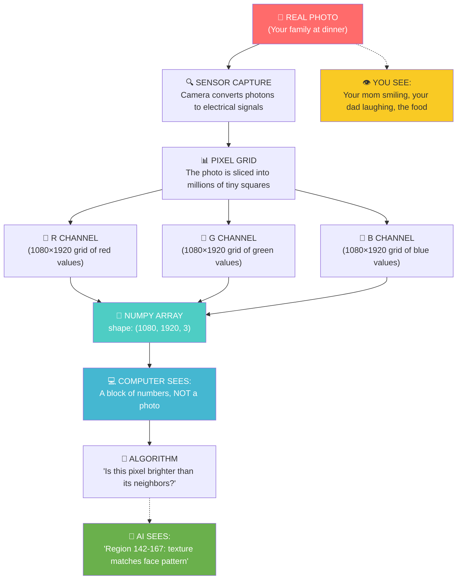

# Chapter 4: The Anatomy of a Snap

---

## Block 1: The Philosophical Hook

**"How does the light become a memory?"**

Look at something in your room right now — a book, a water bottle, your phone. Photons bounce off it, enter your eye, hit your retina, and trigger electrical signals. Your brain takes those signals and constructs a 3D model with color, depth, texture, and meaning.

You don't "see" photons. You see *interpretation*. Your brain is hallucinating reality based on incomplete data — and it's so good at it that you never notice.

A camera does the same thing, but crudely. It captures photons, converts them to electrical charges, and builds a grid of colored dots called **pixels**.

But here's the question that opens this chapter: **If your brain hallucinates reality from incomplete data, and a camera hallucinates an image from pixel grids... at what point does the hallucination become "real"?**

For a computer vision engineer, the answer is simple: when the numbers say so.

---

## Block 2: What We Need to Know (Zero-Math Core)

### The "Mosaic Made of Tiny Tiles" Analogy

Have you ever seen a mosaic made of tiny colored tiles? From far away, it's a picture of a face. Up close, it's just thousands of individual squares.

```text
FAR AWAY:    UP CLOSE:
😊          ■ ■ ■ ■ ■
            ■ ■ ■ ■ ■
            ■ ■ ■ ■ ■
            ■ ■ ■ ■ ■
            ■ ■ ■ ■ ■
  A face    512 tiles of 24 colors each
```

**A digital image is a mosaic.** Each tile is called a **pixel** (short for "picture element"). A 1920×1080 photo is 2,073,600 tiles arranged in a rectangle.

### The RGB Secret

Every pixel is actually three numbers: one for Red, one for Green, one for Blue.

```text
  Pixel (x=10, y=20)
  ┌─────────────────┐
  │  R: 178         │  <- How much RED (0 = none, 255 = full)
  │  G: 34          │  <- How much GREEN (0 = none, 255 = full)
  │  B: 78          │  <- How much BLUE (0 = none, 255 = full)
  └─────────────────┘
  Result: a deep reddish-purple
```

**0 means "none of this color." 255 means "maximum of this color."** Everything in between is a shade.

| RGB Value | Result |
|-----------|--------|
| (255, 0, 0) | Pure red |
| (0, 255, 0) | Pure green |
| (0, 0, 255) | Pure blue |
| (255, 255, 255) | White (all colors full) |
| (0, 0, 0) | Black (no colors) |
| (128, 128, 128) | Gray (all equal, halfway) |
| (255, 255, 0) | Yellow (red + green) |

### Images Are Just Grids of Numbers

A color image is stored as a 3D grid:
- **Height** (how many rows of pixels)
- **Width** (how many pixels per row)
- **Channels** (3 for RGB, 1 for grayscale)

```text
Image shape: (height, width, channels)
Example: A Full HD photo -> (1080, 1920, 3)
          3,110,400 individual numbers
```

### Grayscale: When Color Disappears

A grayscale image has only 1 channel — brightness. 0 = black, 255 = white.

```text
  Grayscale pixel:
  ┌──────────┐
  │  142     │  <- Brightness (0 = black, 255 = white)
  └──────────┘
```

Every color image can be converted to grayscale by averaging the R, G, B values. This is the first thing many CV algorithms do — because brightness is often more useful than color.

---

## Block 3: The Tech Lab (Code & Usage)

Open the companion notebook or type each section into a new Colab cell.

### 4A: Creating an Image from Scratch (Numbers → Picture)

```python
# We'll build an image pixel by pixel using numpy arrays.
# This proves that an image is JUST numbers.

import numpy as np
import matplotlib.pyplot as plt

# Create a 50x50 red image.
# np.zeros creates a grid filled with zeros.
# (50, 50, 3) = 50 rows, 50 columns, 3 color channels.
# dtype=np.uint8 stores numbers as 0-255 (standard for images).

red_image = np.zeros((50, 50, 3), dtype=np.uint8)

# Set all pixels to Red=255, Green=0, Blue=0.
# The colon : means "all rows" and "all columns."
red_image[:, :] = [255, 0, 0]

# Display it.
plt.imshow(red_image)
plt.title("Made of Numbers: Red (255, 0, 0)")
plt.axis('off')
plt.show()
```

### 4B: Making a Gradient (Seeing the Numbers Change)

```python
# Let's create a gradient that goes from black to blue.
# This shows how pixel values can vary gradually.

gradient = np.zeros((100, 256, 3), dtype=np.uint8)

# Loop through each column.
# As 'i' goes from 0 to 255, the blue value increases.

for i in range(256):
    # Set the blue channel to i for all rows in column i.
    gradient[:, i, 2] = i  # Index 2 = Blue channel (0=R, 1=G, 2=B)

plt.imshow(gradient)
plt.title("Gradient: Black → Blue (Blue channel 0→255)")
plt.axis('off')
plt.show()
```

### 4C: Loading a Real Image (Upload to Colab)

```python
# Upload an image from your computer to Colab.
# A file dialog will appear. Pick any .jpg or .png photo.

from google.colab import files
uploaded = files.upload()

# Get the filename of the uploaded file.
filename = list(uploaded.keys())[0]
print("Loaded:", filename)
```

### 4D: Inspecting the Image's Structure

```python
# Load the image with matplotlib's imread (image read).
# This converts the image file into a numpy array of numbers.

image = plt.imread(filename)

# Print the shape: (height, width, channels).
print("Image shape:", image.shape)
print("Data type:", image.dtype)

# Display the image.
plt.imshow(image)
plt.title("Original Image")
plt.axis('off')
plt.show()
```

### 4E: Peeking at the Numbers

```python
# Let's look at the actual numbers that make up the image.
# An image is just a big grid of numbers.

print("First row, first 10 pixels of RED channel:")
print(image[0, :10, 0])  # [row 0, columns 0-9, Red channel]

print("First row, first 10 pixels of GREEN channel:")
print(image[0, :10, 1])

print("First row, first 10 pixels of BLUE channel:")
print(image[0, :10, 2])
```

### 4F: Manipulating Pixels Directly

```python
# We can change the image by changing the numbers.
# Let's make a copy and draw a blue square on it.

modified = image.copy()

# Set rows 20-60, columns 30-70 to pure blue.
# This overwrites that region with blue pixels.

modified[20:60, 30:70] = [0, 0, 1.0]  # RGB = 0, 0, 1.0 (in 0-1 range for matplotlib)

plt.imshow(modified)
plt.title("Blue Square Painted on Image")
plt.axis('off')
plt.show()
```

**Important note:** matplotlib reads images with values 0.0 to 1.0 (float). OpenCV reads with 0 to 255 (integer). Don't let this confuse you — it's the same data, just a different scale. We'll use OpenCV in Chapter 5.

### 4G: Converting to Grayscale (Reducing Channels)

```python
# Convert to grayscale by averaging the R, G, B values at each pixel.
# This turns a 3-channel image into a 1-channel brightness map.

grayscale = np.mean(image, axis=2)  # axis=2 = the color channel dimension.

print("Original shape:", image.shape)
print("Grayscale shape:", grayscale.shape)

# Display using a grayscale color map (cmap='gray').
plt.imshow(grayscale, cmap='gray')
plt.title("Grayscale: Every Pixel = Brightness Only")
plt.axis('off')
plt.show()
```

---

## Block 4: The Family Mirror

### How This Chapter Helps Your Father

Your father's car has a **backup camera**. When he reverses, the camera captures a grid of pixels, the computer looks for certain pixel patterns (like the rectangular shape of a car or the circular edge of a pole), and it beeps if something is too close.

The entire system reduces to: **is this group of pixels changing faster than expected?** That's a question about numbers, not about "objects."

### How This Chapter Helps Your Mother

Your mother's phone uses **face unlock**. The phone's camera captures your mother's face as a grid of pixels, runs it through an algorithm that extracts key facial features (distance between eyes, nose shape, jawline), and compares those numbers to the stored template.

**"It recognizes your face"** = "the numbers from today's photo match the numbers from the day she set it up, within a margin of error."

---

## Block 5: Cognitive Debugging (Issues & Solutions)

### The Mistake: "I see the image but it looks weird — colors are wrong."

```python
# Problem: OpenCV uses BGR order, matplotlib uses RGB order.
# If you read with OpenCV and display with matplotlib, red and blue swap.

import cv2 as cv
img = cv.imread("photo.jpg")      # OpenCV loads as BGR (Blue-Green-Red).
plt.imshow(img)                     # matplotlib displays as RGB (wrong colors!).
plt.show()                          # Everything looks blue-ish.

# Fix: Convert BGR to RGB before displaying.
img_rgb = cv.cvtColor(img, cv.COLOR_BGR2RGB)
plt.imshow(img_rgb)
plt.show()
```

**The psychological fix:** Your brain assumes "red is red" everywhere. The computer's internal ordering might differ. Always check: "What format does this function expect?" This is the origin of countless CV bugs.

### The Mistake: "The image shape shows (1080, 1920, 3) but I thought it was (1920, 1080)."

**Why it happens:** Humans think width × height (like TV screens: "1920×1080"). But numpy arrays store **rows first**, then columns. So shape is (height, width, channels).

**The fix:** Memorize: **rows first, then columns.** Height comes before width in the array.

### The Mistake: "I set a pixel to (300, 0, 0) and got an error."

**Why it happens:** Pixel values must be 0-255 (for uint8) or 0.0-1.0 (for float). 300 is out of range.

**The fix:** Clamp values mentally: "if it's a color channel, it's 0-255 or 0.0-1.0."

---

## Block 6: The AI Assistant Prompt

> You are a patient tutor for a college freshman learning how computers see images. We just learned that images are grids of pixels, RGB channels, and the difference between grayscale and color. Please:
> 1. Explain the RGB color model using the analogy of three flashlights (red, green, blue) shining on the same spot. What color does each combination make?
> 2. Ask me: "If a pixel has RGB values (0, 255, 180), what color is it approximately?"
> 3. Give me a mental exercise: "Imagine a 3×3 pixel image. Draw its RGB array on paper. Then convert it to grayscale by averaging."
> 4. Test me: "What happens to the R, G, B values of a pixel if you make the image darker? Lighter?"
> 5. Be encouraging. If I get something wrong, compare it to mixing paint — "close, but you added too much blue!"

---

## Block 7: The Brain-Tickler (Funny Exercise)

### The "Pixel Peeping" Challenge

Take a selfie. Upload it to Colab. Then write code that:

1. Finds the **brightest pixel** in the image (hint: use `np.max()` or `np.argmax()`).
2. Finds the **darkest pixel**.
3. Prints the RGB values of the pixel at the center of your face.
4. Modifies your selfie so that your **left eye** is covered by a pure red square and your **right eye** by a pure green square.

**Bonus:** Write code that adds 50 to every red pixel in the image (making you look sunburned). Then clip the values to 255 so they don't overflow.

```python
# The sunburn starter:
sunburned = image.copy()
sunburned[:, :, 0] = sunburned[:, :, 0] + 50   # Add 50 red.
sunburned = np.clip(sunburned, 0, 255)          # Keep values in range.
plt.imshow(sunburned)
plt.show()
```

---

## Block 8: Visual Infographic Blueprint



**Title:** "From Family Photo to Numbers — The Journey of a Digital Image"
**Caption:** A photograph of your family is, to a computer, a block of numbers. The "mom" in the photo is just a specific pattern of brightness values. The computer doesn't know she's your mom. It knows she's pixels 312-487 × 156-389 with RGB values averaging (210, 180, 160).

---

## Block 9: The Mentor's Feedback

You just learned to see what the computer sees.

Here's what you unlocked:
- You understand that every digital image is a grid of numbers.
- You know about pixels, RGB channels, and image shape.
- You created images from scratch — arrays of numbers that became visible pictures.
- You loaded a real photo and peeked at its raw pixel values.
- You manipulated pixels and converted to grayscale.
- You learned why OpenCV images look wrong in matplotlib (BGR vs RGB).

**This is the single most important conceptual shift in computer vision:** the photo of your mom that you love is, to the machine, a three-dimensional array of integers. The emotion, the memory, the meaning — those are in you. The machine gets the numbers.

And that's enough for it to do incredible things.

**Take a photo, load it in Colab, and play with the pixels. When you're ready for more power, say "PROCEED" and we'll learn to edit reality.**

---

*— A.L Hossam A. Abdelwahab*
