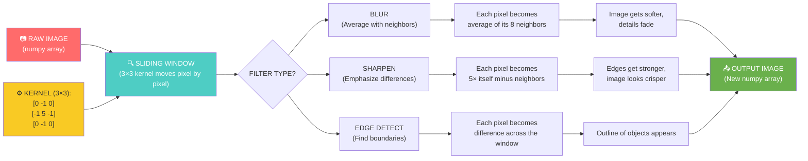

# Chapter 5: The Digital Canvas

---

## Block 1: The Philosophical Hook

**"How much of reality do you actually see?"**

Every second, your brain receives roughly 11 million bits of information from your senses. But your conscious mind can only process about 50 bits per second. That's a 99.9995% data discard rate.

Your brain isn't showing you reality. It's showing you a **filtered, compressed, heavily edited version** of reality — optimized for survival, not accuracy. It removes blur from your peripheral vision. It fills in your blind spot. It stabilizes the jitter of your eye movements.

You're not seeing the world. You're seeing a rendered version of it, created on the fly by your brain's built-in image processing pipeline.

**In this chapter, you'll learn to do exactly what your brain does — but on purpose.** You'll blur, sharpen, transform, and filter images. You'll modify reality by changing numbers. And you'll realize that every photo you've ever seen is already a processed version of the truth.

---

## Block 2: What We Need to Know (Zero-Math Core)

### The "Sponge and Water" Analogy

Imagine a sponge (the original image) soaked with colored water (the pixel data). Image processing is like squeezing the sponge, stretching it, or dipping it in different buckets:

| Operation | What it does | Like... |
|---|---|---|
| **Blur** | Averages each pixel with its neighbors | Rubbing your eyes, losing detail |
| **Sharpen** | Emphasizes differences between neighbors | Putting on glasses, enhancing edges |
| **Grayscale** | Discards color, keeps brightness | Watching a black-and-white movie |
| **Resize** | Changes dimensions | Zooming in/out, image gets pixelated |
| **Rotate** | Spins the image | Tilting your head |
| **Crop** | Keeps only a region | Cutting out the edges of a photo |

### The "Sliding Window" Concept (Neighborhoods)

Most image filters work by looking at a pixel AND its neighbors, then calculating a new value.

```text
Original pixels:       Filtered pixel:
 10  12  15            The new value depends on its
 11  14  18    →       neighbors. Blur = average them.
 13  16  20            Sharpen = emphasize differences.
```

This "sliding window" (called a **kernel** or **filter**) slides across every pixel in the image. This is the single most important mechanism in computer vision.

### The BGR Trap (Colab Note)

OpenCV reads images in **BGR order** (Blue-Green-Red), not RGB. This is a historical quirk. If you display an OpenCV image without converting, red and blue swap.

```text
Your photo → OpenCV reads it → Stored as BGR, Blue channel first
Display with matplotlib → expects RGB → Red and Blue are swapped → Looks weird
Fix: Convert BGR → RGB before displaying
```

---

## Block 3: The Tech Lab (Code & Usage)

Open the companion notebook `05_digital_canvas.ipynb` in Colab and run each cell.

### 5A: Importing OpenCV and the Colab Display Fix

```python
# OpenCV is the industry standard library for computer vision.
# 'cv2' is the module name (the '2' is historical — we're on version 5).

import cv2 as cv

# In Colab, we can't use cv.imshow() (it opens a window on your desktop).
# Instead, we use a special Colab version that displays images inline.

from google.colab.patches import cv2_imshow

# Also import our usual helpers.
import numpy as np
import matplotlib.pyplot as plt
from google.colab import files
```

### 5B: Loading an Image with OpenCV (The BGR Surprise)

```python
# Upload an image.
uploaded = files.upload()
filename = list(uploaded.keys())[0]

# Read with OpenCV. It stores the image as a numpy array, same as before.
# BUT: OpenCV uses BGR order, not RGB!

img_bgr = cv.imread(filename)

# Check the shape (same as before: height, width, channels).
print("Shape:", img_bgr.shape)
print("Data type:", img_bgr.dtype)

# Display with OpenCV's Colab function.
print("Displayed with cv2_imshow (OpenCV format — colors are correct here):")
cv2_imshow(img_bgr)
```

### 5C: The BGR → RGB Conversion (Fixing the Colors)

```python
# Convert BGR to RGB for matplotlib display.
# cvtColor = "convert color" — changes between color spaces.

img_rgb = cv.cvtColor(img_bgr, cv.COLOR_BGR2RGB)

plt.imshow(img_rgb)
plt.title("After BGR→RGB conversion — colors look right now")
plt.axis('off')
plt.show()

# Also convert to grayscale.
# COLOR_BGR2GRAY = "take the BGR image and make it grayscale."
img_gray = cv.cvtColor(img_bgr, cv.COLOR_BGR2GRAY)

print("Grayscale shape:", img_gray.shape)  # (height, width) — no channel dimension!

plt.imshow(img_gray, cmap='gray')
plt.title("Grayscale — one channel, just brightness")
plt.axis('off')
plt.show()
```

### 5D: Blur — Making the Image Soft

```python
# Gaussian Blur: each pixel becomes a weighted average of its neighbors.
# (15, 15) is the kernel size — how big the "sliding window" is.
# Larger kernel = more blur.
# The two numbers must be odd (e.g., 3, 5, 7, 15, 31...).

blurred_light = cv.GaussianBlur(img_rgb, (5, 5), 0)    # Mild blur.
blurred_heavy = cv.GaussianBlur(img_rgb, (31, 31), 0)  # Heavy blur.

# Display all three side by side.
plt.figure(figsize=(15, 5))

plt.subplot(1, 3, 1)
plt.imshow(img_rgb)
plt.title("Original")
plt.axis('off')

plt.subplot(1, 3, 2)
plt.imshow(blurred_light)
plt.title("Blur (kernel=5)")
plt.axis('off')

plt.subplot(1, 3, 3)
plt.imshow(blurred_heavy)
plt.title("Blur (kernel=31)")
plt.axis('off')

plt.show()
```

### 5E: Sharpen — Making the Image Crisp

```python
# Sharpening emphasizes the difference between a pixel and its neighbors.
# We use a custom kernel (a tiny 3x3 grid of numbers).

# Define the sharpening kernel.
# Center = 5, surrounded by -1s = each pixel becomes 5x itself minus its neighbors.
kernel_sharpen = np.array([
    [0, -1,  0],
    [-1,  5, -1],
    [0, -1,  0]
])

# Apply the kernel with filter2D.
sharpened = cv.filter2D(img_rgb, -1, kernel_sharpen)

plt.figure(figsize=(10, 5))
plt.subplot(1, 2, 1)
plt.imshow(img_rgb)
plt.title("Original")
plt.axis('off')

plt.subplot(1, 2, 2)
plt.imshow(sharpened)
plt.title("Sharpened")
plt.axis('off')
plt.show()
```

### 5F: Resize and Rotate

```python
# Resize: shrink the image by half.
# cv.resize takes (width, height) — NOT (height, width)!
# That's a common trap. OpenCV uses (width, height), numpy uses (height, width).

height, width = img_rgb.shape[:2]  # Get original dimensions.
new_width = width // 2
new_height = height // 2

small_img = cv.resize(img_rgb, (new_width, new_height))
print(f"Original: {width}x{height} → Resized: {new_width}x{new_height}")

plt.imshow(small_img)
plt.title("Half size")
plt.axis('off')
plt.show()

# Rotate: get the image center and rotation matrix.
# This looks complex but all it does is: "spin the image 45 degrees."

center = (width // 2, height // 2)
rotation_matrix = cv.getRotationMatrix2D(center, 45, 1.0)  # 45 degrees, scale 1.0
rotated = cv.warpAffine(img_rgb, rotation_matrix, (width, height))

plt.imshow(rotated)
plt.title("Rotated 45 degrees")
plt.axis('off')
plt.show()
```

### 5G: Crop — Keep Only the Interesting Part

```python
# Cropping is just numpy array slicing.
# [y_start:y_end, x_start:x_end] — remember: rows (y) come first!

# Example: crop the center 30% of the image.
crop_y_start = height // 3
crop_y_end = 2 * height // 3
crop_x_start = width // 3
crop_x_end = 2 * width // 3

cropped = img_rgb[crop_y_start:crop_y_end, crop_x_start:crop_x_end]

plt.imshow(cropped)
plt.title("Cropped center region")
plt.axis('off')
plt.show()
```

### 5H: The "Social Media Filter" — Putting It All Together

```python
# Let's create a filter that:
# 1. Blurs the background (makes face stand out).
# 2. Sharpens the face region.
# 3. Adds a color tint.

# For now, we'll do a simpler version: blur everything,
# then overlay a colored rectangle in the corner (like a vintage Instagram filter).

# Create a copy and blur the whole image.
filtered = img_rgb.copy()

# Apply a warm tint: increase red, decrease blue.
filtered[:, :, 0] = filtered[:, :, 0] * 0.8   # Reduce red channel.
filtered[:, :, 2] = filtered[:, :, 2] * 1.3   # Increase blue channel (warmth).
filtered = np.clip(filtered, 0, 255).astype(np.uint8)  # Keep values in valid range.

plt.figure(figsize=(10, 5))
plt.subplot(1, 2, 1)
plt.imshow(img_rgb)
plt.title("Original")
plt.axis('off')

plt.subplot(1, 2, 2)
plt.imshow(filtered)
plt.title("Warm Vintage Filter")
plt.axis('off')
plt.show()

# Save the filtered image.
cv.imwrite("filtered_photo.jpg", cv.cvtColor(filtered, cv.COLOR_RGB2BGR))
print("Saved as filtered_photo.jpg")
```

---

## Block 4: The Family Mirror

### How This Chapter Helps Your Father

Every "beauty mode" or "portrait mode" photo your father takes on his phone uses exactly the filters you just learned. **Blur = GaussianBlur. Sharpening = filter2D.** The phone industry has spent billions perfecting what you just did in 20 lines of code.

### How This Chapter Helps Your Mother

Your mother's photo editing app has a "auto-enhance" button. It runs:
1. Convert to grayscale and check brightness distribution.
2. Adjust contrast (stretch the dark and light ends).
3. Apply mild sharpening.
4. Tweak color balance.

Every "magic" button in photo software is just a sequence of the operations you just learned, chained together and automated.

---

## Block 5: Cognitive Debugging (Issues & Solutions)

### The Mistake: "I used cv.imshow() and got a weird error or nothing happened."

```python
# Wrong — cv.imshow() opens a GUI window. Colab has no screen.
# cv.imshow("My Image", img)  # This crashes or hangs in Colab.

# Right — use the Colab patch.
from google.colab.patches import cv2_imshow
cv2_imshow(img)
```

**Why it happens:** OpenCV's `imshow` was designed for desktop apps with a physical monitor. In Colab, you're running on a server. There's no monitor.

### The Mistake: "My image looks blue-ish/orange-ish."

```python
# Problem: OpenCV loads as BGR, you displayed as RGB.
# Fix: Convert first.

# Wrong:
# plt.imshow(cv.imread("photo.jpg"))  # BGR displayed as RGB = wrong colors.

# Right:
img = cv.imread("photo.jpg")
img_rgb = cv.cvtColor(img, cv.COLOR_BGR2RGB)
plt.imshow(img_rgb)  # Correct colors.
```

### The Mistake: "cv.resize() changed my image size to the wrong aspect ratio."

```python
# Problem: You passed (width, height) but the aspect ratio doesn't match.

# Wrong — stretches the image.
# resized = cv.resize(img, (300, 300))

# Right — maintain aspect ratio.
h, w = img.shape[:2]
aspect_ratio = w / h
new_height = 300
new_width = int(new_height * aspect_ratio)
resized = cv.resize(img, (new_width, new_height))
```

---

## Block 6: The AI Assistant Prompt

> You are a creative image processing tutor for a college freshman. We just learned Gaussian blur, sharpening, resizing, rotating, cropping, and color filtering. Please:
> 1. Ask me to describe the "sliding window" concept in my own words. Correct my analogy if needed.
> 2. Challenge me: "If you wanted to create a 'dreamy' filter (soft glow), what combination of blur, brightness, and color adjustment would you use?"
> 3. Give me a puzzle: "If I apply blur with kernel size 3, then sharpen with the kernel we used, what do you think happens to the image? Try it."
> 4. Explain the difference between "GaussianBlur" and "medianBlur" using a simple analogy (like raindrops on a window vs. smudging with a finger).
> 5. Keep explanations at an 8th-grade level. No math beyond basic arithmetic.

---

## Block 7: The Brain-Tickler (Funny Exercise)

### The "8-Hours-of-Sleep" Filter Challenge

Upload a photo of yourself looking tired (morning face, late-night study session). Write a filter pipeline that:

1. **Brightens** the image by adding a fixed value to all pixels (simulating waking up).
2. **Reduces** red in the eyes (simulating no longer being bloodshot).
3. **Blurs** skin texture slightly (simulating smooth, rested skin).
4. **Increases** contrast (simulating alertness).

```python
# Starter code:
face = img_rgb.copy()

# Step 1: Brighten (add 30 to every pixel).
face = np.clip(face + 30, 0, 255)

# Step 2: Reduce redness (multiply red channel by 0.8).
face[:, :, 0] = face[:, :, 0] * 0.8

# Step 3: Blur skin (mild GaussianBlur).
face = cv.GaussianBlur(face, (3, 3), 0)

# Step 4: Increase contrast (stretch pixel values).
# ... (experiment!)

plt.imshow(face)
plt.title("The 'I Totally Slept 8 Hours' Filter")
plt.axis('off')
plt.show()
```

**Show the "before" and "after" to a friend. Ask: "Which one looks more well-rested?" If they pick the filtered one, your filter works.**

---

## Block 8: Visual Infographic Blueprint



**Title:** "The Sliding Window — Every Image Filter's Secret"
**Caption:** Every filter you applied (blur, sharpen, edge detection) uses the same mechanism: a tiny grid of numbers (kernel) slides across every pixel. The kernel determines the effect. Change the kernel numbers, change reality.

---

## Block 9: The Mentor's Feedback

You just became a digital artist and a reality editor.

Here's what you conquered:
- You installed and imported OpenCV (the industry standard).
- You learned the BGR trap and how to fix it.
- You blurred and sharpened images like a pro photo editor.
- You resized, rotated, and cropped with precision.
- You created a custom color filter (your first "filter"!).
- You built the first version of a social-media-style filter pipeline.

**The most important insight in this chapter:** Every "magic" photo filter you've ever used is just a sequence of number-grid transformations. The Instagram team didn't invent magic — they invented good combinations of the operations you just wrote.

**You're not using an image editor anymore. You're building one.**

When you're ready for the next level, say **PROCEED** and we'll teach the machine to find edges — the first step toward actual vision.

---

*— A.L Hossam A. Abdelwahab*
