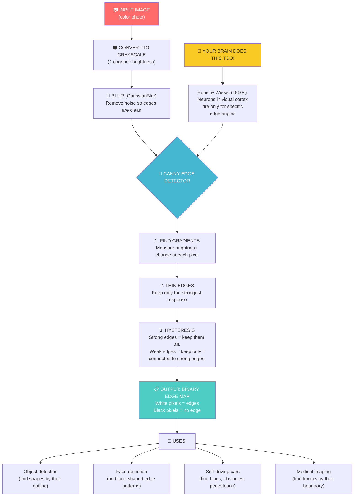

# Chapter 6: Finding the Edges

---

## Block 1: The Philosophical Hook

**"How do you know where one thing ends and another begins?"**

Look at a book sitting on a desk. How do you know where the book ends and the desk begins? Obvious, right? The book's color is different from the desk's color. There's a line between them.

But that line doesn't exist in reality. It's a **difference in brightness** that your brain interprets as a boundary. The world is continuous — objects blend into each other at the atomic level. Your brain draws the lines.

In the 1950s and 60s, neuroscientists David Hubel and Torsten Wiesel made a stunning discovery: your visual cortex has **specialized neurons that fire ONLY when they detect an edge at a specific angle**. Some neurons fire for horizontal edges. Others for vertical. Others for diagonal.

Your brain is literally made of thousands of tiny edge detectors, working in parallel. They don't know what the object IS. They just know "brightness changed here, at this angle." Higher brain regions assemble these edge signals into shapes, objects, faces, meaning.

**An AI does the same thing.** The Canny edge detector you'll use in this chapter is the algorithmic equivalent of those neurons in the back of your skull. The only difference: your neurons are biological; the computer's are mathematical.

---

## Block 2: What We Need to Know (Zero-Math Core)

### The "Basketball and Wall" Analogy

Imagine throwing a basketball at a wall. The ball follows a smooth arc (no edge). Now imagine the wall suddenly turns into a cliff. The path abruptly drops — that's an **edge**.

Mathematically, an edge is a **sudden jump** in pixel brightness. Not a gradual change — a sharp one.

```text
Gradual change (NO edge):          Sharp change (EDGE!):
Brightness:                        Brightness:
100  102  104  106  108            100  100  100  200  200
  \    \    \    \    /              \    \    \  |  /
   No jump detected                 JUMP! Edge found here
```

### The Four Steps of Canny Edge Detection (No Math Version)

The Canny algorithm (the most popular edge detector) does four things:

1. **Blur first** — removes noise so we don't detect "false edges" from grain.
2. **Find gradients** — measures how fast brightness is changing at each pixel.
3. **Thin the edges** — only the strongest response at each edge stays (non-maximum suppression).
4. **Hysteresis thresholding** — two thresholds: anything above the high threshold IS an edge; anything below the low threshold is NOT; things in between are edges ONLY if connected to a strong edge.

**Think of it like a detective:**
1. Clean your glasses (blur).
2. Look for sudden changes (gradient).
3. Only keep the sharpest line at each edge (thin).
4. Trust the clear clues, and follow them to the faint ones (hysteresis).

### Sobel: The Direction-Aware Edge Detector

Sobel detects edges but also tells you the **direction** (horizontal, vertical, or diagonal). This is useful when you want to find, say, only horizontal edges (like lane markings on a road).

---

## Block 3: The Tech Lab (Code & Usage)

Open the companion notebook `06_finding_edges.ipynb` or type each section into Colab.

### 6A: Setup and Load Image

```python
import cv2 as cv
import numpy as np
import matplotlib.pyplot as plt
from google.colab.patches import cv2_imshow
from google.colab import files

uploaded = files.upload()
filename = list(uploaded.keys())[0]

# Load and convert to RGB.
img_bgr = cv.imread(filename)
img_rgb = cv.cvtColor(img_bgr, cv.COLOR_BGR2RGB)
img_gray = cv.cvtColor(img_bgr, cv.COLOR_BGR2GRAY)

plt.imshow(img_rgb)
plt.title("Original")
plt.axis('off')
plt.show()
```

### 6B: Canny Edge Detection — The Gold Standard

```python
# Canny(image, low_threshold, high_threshold)
# Low threshold = 50, high threshold = 150 (standard starting values).
# Any edge stronger than 150 is definitely an edge.
# Any edge weaker than 50 is ignored.
# Edges between 50 and 150 are kept only if connected to a strong edge.

edges = cv.Canny(img_gray, 50, 150)

print("Edge image shape:", edges.shape)
print("White pixels = edges, Black pixels = no edge.")

plt.figure(figsize=(10, 5))
plt.subplot(1, 2, 1)
plt.imshow(img_rgb)
plt.title("Original")
plt.axis('off')

plt.subplot(1, 2, 2)
plt.imshow(edges, cmap='gray')
plt.title("Canny Edges (50, 150)")
plt.axis('off')
plt.show()
```

### 6C: Experimenting with Thresholds

```python
# Lower thresholds = more edges detected (including noise).
# Higher thresholds = fewer edges (only the strongest).

edges_loose = cv.Canny(img_gray, 10, 50)      # Catches everything, lots of noise.
edges_tight = cv.Canny(img_gray, 100, 200)     # Only strongest edges.
edges_balanced = cv.Canny(img_gray, 50, 150)   # The standard sweet spot.

plt.figure(figsize=(15, 5))

plt.subplot(1, 3, 1)
plt.imshow(edges_loose, cmap='gray')
plt.title("Loose (10, 50) — too many")
plt.axis('off')

plt.subplot(1, 3, 2)
plt.imshow(edges_balanced, cmap='gray')
plt.title("Balanced (50, 150) — just right")
plt.axis('off')

plt.subplot(1, 3, 3)
plt.imshow(edges_tight, cmap='gray')
plt.title("Tight (100, 200) — too few")
plt.axis('off')

plt.show()
```

### 6D: Sobel — Directional Edge Detection

```python
# Sobel detects edges in a specific direction.
# cv.CV_64F means "use 64-bit floats for precision" (standard).
# ksize=5 is the kernel size (how wide the detection window is).

# Horizontal edges (things that go left-right).
sobel_x = cv.Sobel(img_gray, cv.CV_64F, 1, 0, ksize=5)

# Vertical edges (things that go up-down).
sobel_y = cv.Sobel(img_gray, cv.CV_64F, 0, 1, ksize=5)

# Combine both directions into one image.
sobel_combined = cv.bitwise_or(np.abs(sobel_x), np.abs(sobel_y))

# Convert to 8-bit for display.
sobel_x_display = np.uint8(np.abs(sobel_x))
sobel_y_display = np.uint8(np.abs(sobel_y))

plt.figure(figsize=(15, 5))

plt.subplot(1, 3, 1)
plt.imshow(sobel_x_display, cmap='gray')
plt.title("Sobel X (Horizontal edges)")
plt.axis('off')

plt.subplot(1, 3, 2)
plt.imshow(sobel_y_display, cmap='gray')
plt.title("Sobel Y (Vertical edges)")
plt.axis('off')

plt.subplot(1, 3, 3)
plt.imshow(sobel_combined, cmap='gray')
plt.title("Sobel Combined")
plt.axis('off')

plt.show()
```

### 6E: Blur Before Edge Detection (The Cleanup Step)

```python
# Blur removes noise so edges are cleaner.
# Without blur: edges include grain, dust, texture (false positives).
# With blur: only real object boundaries survive.

# Apply Gaussian blur before Canny.
blurred = cv.GaussianBlur(img_gray, (5, 5), 0)
edges_clean = cv.Canny(blurred, 50, 150)

# Compare: no blur vs blur.
edges_no_blur = cv.Canny(img_gray, 50, 150)

plt.figure(figsize=(10, 5))
plt.subplot(1, 2, 1)
plt.imshow(edges_no_blur, cmap='gray')
plt.title("Edges without blur — noisy")
plt.axis('off')

plt.subplot(1, 2, 2)
plt.imshow(edges_clean, cmap='gray')
plt.title("Edges with blur — cleaner")
plt.axis('off')

plt.show()
```

### 6F: Edge Overlay — Seeing Edges on Top of the Original

```python
# Let's overlay the edges on the original image.
# This shows how edges outline the objects.

# Convert edges to a 3-channel image so we can overlay colors.
edges_colored = cv.cvtColor(edges_clean, cv.COLOR_GRAY2RGB)

# Make edges green (or any color) and dim the background.
overlay = img_rgb.copy()
overlay[edges_clean > 0] = [0, 255, 0]  # Green edges.

plt.figure(figsize=(10, 5))
plt.subplot(1, 2, 1)
plt.imshow(img_rgb)
plt.title("Original")
plt.axis('off')

plt.subplot(1, 2, 2)
plt.imshow(overlay)
plt.title("Edges Overlayed (Green)")
plt.axis('off')

plt.show()
```

### 6G: The "Sketch Effect" — Using Edges to Make a Drawing

```python
# Invert the edge image to create a sketch-like effect.
# White background + black lines = pencil sketch.

sketch = cv.bitwise_not(edges_clean)  # Invert: white→black, black→white.

plt.figure(figsize=(10, 5))
plt.subplot(1, 2, 1)
plt.imshow(img_rgb)
plt.title("Original Photo")
plt.axis('off')

plt.subplot(1, 2, 2)
plt.imshow(sketch, cmap='gray')
plt.title("Pencil Sketch Effect")
plt.axis('off')

plt.show()
```

---

## Block 4: The Family Mirror

### How This Chapter Helps Your Father

Your father's car uses lane-keeping assist. It applies a **Sobel horizontal edge detector** to find lane markings on the road (horizontal edges = lines painted across the road from the car's perspective). If the car drifts and the lane markings shift position in the image, the system alerts him or corrects the steering.

**Lane detection = find horizontal edges, check if they're in the expected position.**

### How This Chapter Helps Your Mother

Your mother's photo scanner app has "auto-crop document" — it finds the **edges of the paper** in a photo, traces the rectangle, and crops perfectly. It uses Canny edge detection to find the paper boundaries, then looks for the four corners of the rectangle (where vertical and horizontal edges meet).

**Document scanning = Canny edges + find the biggest rectangle.**

---

## Block 5: Cognitive Debugging (Issues & Solutions)

### The Mistake: "I set Canny thresholds to (0, 255) and got no edges... or everything is an edge."

```python
# Wrong:
edges = cv.Canny(img_gray, 0, 255)  # Too much range: detects all noise.
edges = cv.Canny(img_gray, 254, 255)  # Too narrow: detects almost nothing.

# Right: start with (50, 150) and adjust.
edges = cv.Canny(img_gray, 50, 150)
```

**The fix:** The low threshold should be about 1/3 of the high threshold. Start with (50, 150) and adjust the pair together. If you increase the high, increase the low proportionally.

### The Mistake: "I forgot to convert to grayscale first."

```python
# Wrong — Canny expects a single-channel (grayscale) image.
# edges = cv.Canny(img_rgb, 50, 150)  # Error or weird results.

# Right — convert to grayscale first.
gray = cv.cvtColor(img_rgb, cv.COLOR_RGB2GRAY)
edges = cv.Canny(gray, 50, 150)
```

**Why it happens:** Canny works on brightness changes. A color image has 3 channels. Canny doesn't know which channel to use. By converting to grayscale, you're saying "use total brightness as the signal."

### The Mistake: "My Sobel output looks like static."

```python
# Problem: Sobel outputs 64-bit floats, but imshow expects 8-bit.
# Fix: Convert to absolute value, then to 8-bit.

sobel_x = cv.Sobel(img_gray, cv.CV_64F, 1, 0, ksize=5)
sobel_x_display = np.uint8(np.abs(sobel_x))  # This line is critical.
```

---

## Block 6: The AI Assistant Prompt

> You are a friendly computer vision tutor for a college freshman. We just learned Canny edge detection and Sobel operators. Please:
> 1. Ask me to explain in my own words: "What IS an edge in an image, in terms of pixel brightness?"
> 2. Give me a puzzle: "Imagine a photo of a white plate on a black table. Draw the brightness values across a line that crosses the edge of the plate. Where would Canny find an edge?"
> 3. Explain why we blur before edge detection using the analogy of "a dusty window vs a clean window."
> 4. Challenge me: "If you wanted to detect only vertical edges (like the legs of a chair), which Sobel variant would you use?"
> 5. Test me: "What would happen to the edge image if you swapped the low and high Canny thresholds?" (Trick question — the function would swap internally.)
> 6. Use simple language. No formulas.

---

## Block 7: The Brain-Tickler (Funny Exercise)

### The "Roommate Detection" Challenge

Take a photo of your messy dorm room / desk. Write code that:

1. Converts to grayscale and applies Canny edge detection.
2. Counts how many **edges** are in the image (hint: `np.sum(edges > 0)` or `np.count_nonzero(edges)`).
3. Displays the edge overlay and declares: **"Your room has [X] edges of messiness."**
4. Then apply a heavy blur so the edges disappear — your "room is clean now" filter.

```python
messy = img_gray.copy()

# Count edges.
edges_messy = cv.Canny(messy, 50, 150)
edge_count = np.count_nonzero(edges_messy)
print(f"Your room has {edge_count} edges of messiness.")

# "Clean" the room by blurring until edges disappear.
clean = cv.GaussianBlur(messy, (51, 51), 0)
edges_clean_room = cv.Canny(clean, 50, 150)
clean_count = np.count_nonzero(edges_clean_room)
print(f"After cleaning: only {clean_count} edges remain. Much better.")

plt.figure(figsize=(12, 4))
plt.subplot(1, 3, 1)
plt.imshow(messy, cmap='gray')
plt.title("Messy Room")
plt.axis('off')

plt.subplot(1, 3, 2)
plt.imshow(edges_messy, cmap='gray')
plt.title(f"Messy Edges: {edge_count}")
plt.axis('off')

plt.subplot(1, 3, 3)
plt.imshow(edges_clean_room, cmap='gray')
plt.title(f"Clean Edges: {clean_count}")
plt.axis('off')

plt.show()
```

**Bonus:** Write to your mom: "Mom, I used AI to clean my room today. Here's proof." Attach the blurry edge image.

---

## Block 8: Visual Infographic Blueprint



**Title:** "From Photo to Outlines — How Edge Detection Works"
**Caption:** Edge detection is the bridge between raw pixels and meaningful shapes. The computer doesn't know it's looking at a face. It knows it found 2,847 edges that happen to form a face-like pattern.

---

## Block 9: The Mentor's Feedback

You just taught the computer to see outlines.

Here's what you conquered:
- You learned what an edge actually IS (a sharp brightness change).
- You used Canny edge detection — the most famous algorithm in computer vision.
- You played with thresholds and saw how they control sensitivity.
- You used Sobel for directional edge detection (horizontal vs vertical).
- You learned why blur comes before edge detection.
- You created a pencil sketch effect and a "messiness counter."
- You overlaid green edges on your photo — like a robot's vision.

**This is the chapter where you stop being a "filter user" and start being a "feature extractor."** Edges are the first real "feature" — a meaningful property of an image that an AI can use to make decisions.

Every object detection system ever built starts with edges. Faces. Cars. Tumors. Lane markings. They all begin as edge maps.

**You're not just editing images anymore. You're dissecting them.**

When you're ready for the next step, say **PROCEED** and we'll explore the data universe — where images come from and how to organize thousands of them.

---

*— A.L Hossam A. Abdelwahab*
