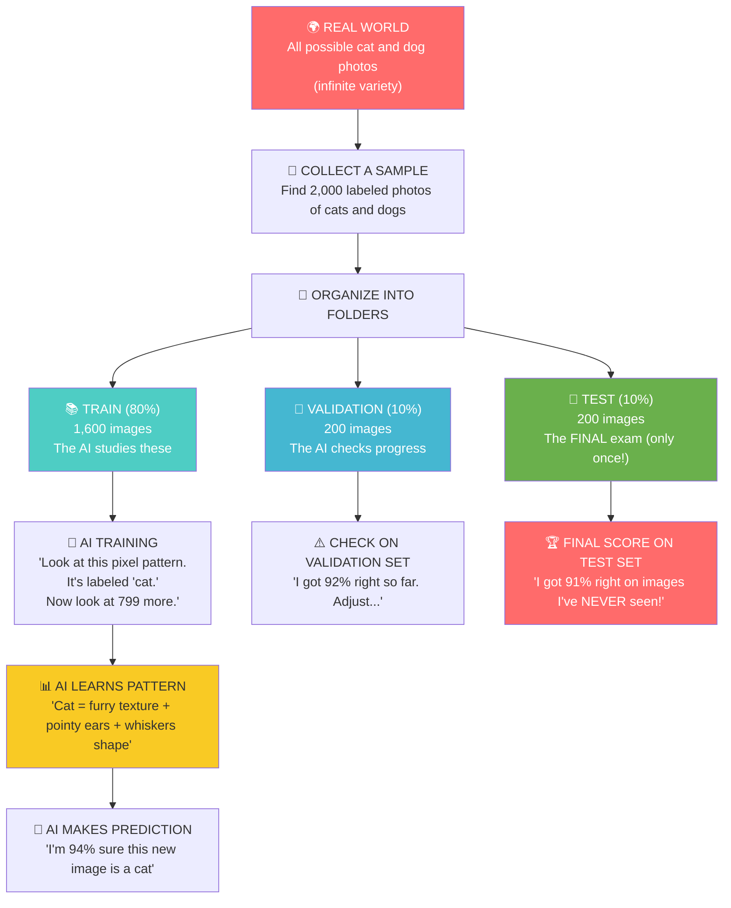

# Chapter 7: The Data Universe

---

## Block 1: The Philosophical Hook

**"How many apples have you seen in your life?"**

Think about it. Every apple you've ever eaten, seen in a grocery store, noticed in a painting, watched in a cartoon. By the time you were 3 years old, your brain had seen thousands of apples from every angle, under every lighting condition, in every color variant.

That's why you can recognize an apple instantly — even a green one, even half-hidden behind a leaf, even as a sketch.

Now imagine you're an AI. You've never seen an apple. You don't know what "red" means. You don't know what "round" means. You have no concept of "fruit."

**How many apples would YOU need to see before you could recognize one?**

The answer is: **a lot**. Thousands. Tens of thousands. And that's the dirty secret of AI: the algorithm isn't the magic. The data is.

This chapter is about the fuel that powers every AI system ever built: the **dataset**. You'll learn where to find them, how to organize them, and why your AI is only as good as the data you feed it.

---

## Block 2: What We Need to Know (Zero-Math Core)

### The "Foreign Language Immersion" Analogy

Imagine you're dropped in a country where you don't speak the language. How do you learn?

You observe. You see people point at a four-legged furry thing and say "dog." You see many four-legged furry things, all slightly different, all called "dog." Eventually, your brain extracts the pattern: four legs, fur, wet nose, wags tail = dog.

**A dataset is the same thing for an AI: a collection of examples that teach the AI a pattern.**

```text
Example: you see:                    Example: AI sees:
"Dog" + picture of a golden retriever    "dog" + pixel array (224x224x3)
"Dog" + picture of a poodle              "dog" + pixel array (224x224x3)
"Dog" + picture of a husky               "dog" + pixel array (224x224x3)

→ Pattern: furry, 4 legs, floppy ears → Pattern: specific pixel configurations
→ You can now identify any dog         → AI can now identify any dog
```

### The Anatomy of a Dataset Folder

Datasets are organized into folders. The most common structure:

```
dataset/
├── train/
│   ├── cats/          ← All images in this folder are labeled "cat"
│   │   ├── cat_001.jpg
│   │   ├── cat_002.jpg
│   │   └── ...
│   └── dogs/          ← All images in this folder are labeled "dog"
│       ├── dog_001.jpg
│       ├── dog_002.jpg
│       └── ...
├── val/               ← Validation set (used during training to check progress)
│   ├── cats/
│   └── dogs/
└── test/              ← Test set (only used ONCE at the end, to measure final performance)
    ├── cats/
    └── dogs/
```

**Why split into train/val/test?**

| Set | Purpose | Like studying for an exam... |
|---|---|---|
| **Train** | The AI learns from this data | Your textbook and class notes |
| **Validation** | Check progress during learning | Practice quizzes before the final |
| **Test** | Final exam — only taken ONCE | The actual final exam |

If the AI sees the test data during training, it would "cheat" — memorize the answers instead of learning the pattern. That's called **data leakage**, and it's a cardinal sin in ML.

### Introducing Kaggle

Kaggle (kaggle.com) is like a giant library of free datasets. It's the place where:
- Companies publish datasets for research.
- Data scientists compete to build the best models.
- You can download image datasets with one click.

For this book, we'll use a small dataset from Kaggle. But the concepts apply to any dataset of any size.

### How Much Data is Enough?

| Task | Minimum images needed | Comfortable |
|---|---|---|
| Cat vs Dog (2 classes) | 100 per class | 1,000+ per class |
| Face detection | 500 faces | 10,000+ faces |
| 100 object types | 100 per class | 500+ per class |

More data almost always beats a better algorithm. **Data is king.**

---

## Block 3: The Tech Lab (Code & Usage)

Run these cells in a new Colab notebook or adapt from the chapter.

### 7A: Creating a Simple Folder Structure

```python
# Let's create a mini dataset folder structure right in Colab.
# This simulates what a real dataset looks like.
# 'os' and 'shutil' are Python libraries for working with files and folders.

import os
import shutil
from google.colab import files

# Define the root path where we'll build our dataset.
base_path = "/content/mini_dataset"

# Create the main folders.
# os.makedirs creates a folder (and any parent folders if they don't exist).
# exist_ok=True means "don't crash if the folder already exists."

os.makedirs(f"{base_path}/train/cats", exist_ok=True)
os.makedirs(f"{base_path}/train/dogs", exist_ok=True)
os.makedirs(f"{base_path}/val/cats", exist_ok=True)
os.makedirs(f"{base_path}/val/dogs", exist_ok=True)
os.makedirs(f"{base_path}/test/cats", exist_ok=True)
os.makedirs(f"{base_path}/test/dogs", exist_ok=True)

print("Dataset folder structure created!")
print(os.listdir(base_path))
```

### 7B: Loading Dataset Information

```python
# Let's count images in a dataset folder (even if empty for now).

def count_images(folder_path):
    """Count image files (.jpg, .png, .jpeg) in a folder."""
    # os.listdir lists all files in a folder.
    # The 'if' filters to only image extensions.
    count = 0
    for file in os.listdir(folder_path):
        if file.endswith(('.jpg', '.png', '.jpeg')):
            count += 1
    return count

# Count images in each split and class.
splits = ['train', 'val', 'test']
classes = ['cats', 'dogs']

for split in splits:
    for cls in classes:
        folder = f"{base_path}/{split}/{cls}"
        num = count_images(folder)
        print(f"{split}/{cls}: {num} images")
```

### 7C: Downloading a Real Dataset from Kaggle (in Colab)

```python
# To download from Kaggle in Colab:
# 1. Go to kaggle.com → Account → Create API Token.
# 2. This downloads a kaggle.json file. Upload it below.

from google.colab import files
print("Step 1: Upload your kaggle.json API token.")
kaggle_token = files.upload()

# Move the token to the correct location.
# 'mv' moves the file. 'chmod' makes it readable.
!mkdir -p ~/.kaggle
!mv kaggle.json ~/.kaggle/
!chmod 600 ~/.kaggle/kaggle.json

print("Step 2: Download a dataset (e.g., cats and dogs).")
# !kaggle is a command-line tool for interacting with Kaggle.
# datasets download tells Kaggle to download a dataset.
# -p specifies where to save it.

!kaggle datasets download -d tongpython/cat-and-dog -p /content/dataset --unzip

print("Step 3: Check the downloaded structure.")
!ls /content/dataset
```

**Note:** If you don't have a Kaggle account, don't worry. You can use Google's built-in dataset or just create your own by uploading photos.

### 7D: Using Google's Built-in Dataset (No Kaggle Needed)

```python
# Colab has a built-in cats and dogs dataset that requires no authentication.
# Let's use this instead — it's easier.

import tensorflow as tf  # We'll import TensorFlow just for datasets.

# Get the cats vs dogs dataset from TensorFlow's collection.
# This downloads about 2,000 images of cats and dogs.
# get_file downloads from a URL if not cached.

dataset_url = "https://storage.googleapis.com/mledu-datasets/cats_and_dogs_filtered.zip"
dataset_path = tf.keras.utils.get_file("cats_and_dogs.zip", dataset_url, extract=True)

print("Dataset downloaded to:", dataset_path)
print("Contents:", os.listdir(dataset_path))

# The dataset is extracted to a folder.
# Let's navigate into it.
dataset_root = os.path.dirname(dataset_path) + "/cats_and_dogs_filtered"
print("\nDataset structure:")
print(os.listdir(dataset_root))
print(os.listdir(f"{dataset_root}/train"))
```

### 7E: Exploring the Dataset

```python
# Let's examine the structure of the downloaded dataset.

import matplotlib.pyplot as plt
import matplotlib.image as mpimg  # mpimg = "matplotlib image" for reading images.

train_cats_path = f"{dataset_root}/train/cats"
train_dogs_path = f"{dataset_root}/train/dogs"

# Count images.
num_cats = len(os.listdir(train_cats_path))
num_dogs = len(os.listdir(train_dogs_path))

print(f"Training cats: {num_cats}")
print(f"Training dogs: {num_dogs}")

# Display a grid of sample images.
plt.figure(figsize=(10, 5))

# Show the first cat image.
cat_files = os.listdir(train_cats_path)
first_cat = mpimg.imread(f"{train_cats_path}/{cat_files[0]}")

plt.subplot(1, 2, 1)
plt.imshow(first_cat)
plt.title(f"Cat sample: {cat_files[0]}")
plt.axis('off')

# Show the first dog image.
dog_files = os.listdir(train_dogs_path)
first_dog = mpimg.imread(f"{train_dogs_path}/{dog_files[0]}")

plt.subplot(1, 2, 2)
plt.imshow(first_dog)
plt.title(f"Dog sample: {dog_files[0]}")
plt.axis('off')

plt.show()

print(f"Cat image shape: {first_cat.shape}")
print(f"Dog image shape: {first_dog.shape}")
```

### 7F: Checking Image Sizes (Why They Must Be Uniform)

```python
# Images in a dataset often have different sizes.
# Neural networks expect ALL images to be the SAME size.
# This is why we RESIZE them during preprocessing.

sizes_cats = []
sizes_dogs = []

for file in cat_files[:10]:  # Check first 10.
    img = mpimg.imread(f"{train_cats_path}/{file}")
    sizes_cats.append(img.shape)

for file in dog_files[:10]:
    img = mpimg.imread(f"{train_dogs_path}/{file}")
    sizes_dogs.append(img.shape)

print("Cat image shapes (first 10):")
for s in sizes_cats:
    print(f"  {s}")

print("\nDog image shapes (first 10):")
for s in sizes_dogs:
    print(f"  {s}")

# They're likely different! This is why preprocessing is essential.
```

### 7G: Building Your Own Mini Dataset

```python
# If you don't want to download datasets, you can create your own.
# Upload photos of 2 subjects (e.g., "phone" and "book").

print("Upload images for class 1 (e.g., 'phone'):")
class1 = files.upload()

print("Upload images for class 2 (e.g., 'book'):")
class2 = files.upload()

# Create a dataset on the fly.
os.makedirs(f"{base_path}/train/phone", exist_ok=True)
os.makedirs(f"{base_path}/train/book", exist_ok=True)

# Move uploaded files into the dataset.
import shutil
for filename in class1.keys():
    shutil.move(filename, f"{base_path}/train/phone/{filename}")

for filename in class2.keys():
    shutil.move(filename, f"{base_path}/train/book/{filename}")

print(f"Class 'phone': {len(os.listdir(f'{base_path}/train/phone'))} images")
print(f"Class 'book': {len(os.listdir(f'{base_path}/train/book'))} images")
```

---

## Block 4: The Family Mirror

### How This Chapter Helps Your Father

Your father's favorite streaming service (Netflix, YouTube) uses a **recommendation system** trained on a dataset of millions of users' watch histories. Every time it suggests a movie he might like, it's because the AI found patterns in the data: "Users who watched Die Hard also watched The Equalizer."

The data didn't come from engineers writing rules. It came from watching what millions of users actually did.

### How This Chapter Helps Your Mother

Your mother's phone has a **photo gallery app that automatically groups faces**. It was trained on a dataset of thousands of labeled faces. The AI didn't learn "this is Mom" by magic — it learned by seeing 500 photos labeled "Mom" and extracting the pattern of her facial features.

---

## Block 5: Cognitive Debugging (Issues & Solutions)

### The Mistake: "My model performed great on training data but fails in the real world."

**Why it happens:** The training data doesn't represent the real world. Maybe all cat photos in the dataset were taken indoors, but the real cat photos your friend shows are outdoors. The AI learned "indoor" not "cat."

**The fix:** Make sure your dataset captures the **variability of the real world**: different lighting, angles, backgrounds, devices, and conditions.

### The Mistake: "I accidentally trained with the test set included."

**Why it happens:** You might download a dataset and not notice that test images are mixed in. Or you shuffle all data together and split randomly, but the split includes some of the same images in both train and test.

**The fix:** Always maintain separate train/val/test folders. Never shuffle them together. Touch the test set ONLY at the very end.

### The Mistake: "I have 1,000 images of cats and 10 images of dogs — my model only predicts 'cat.'"

**Why it happens:** This is called **class imbalance**. The AI learned "when in doubt, guess 'cat'" because it's right 99% of the time.

**The fix:** Either:
- Collect more dog images.
- Give dog images more weight during training (weighted loss).
- Use data augmentation (we'll cover this in Ch8).

---

## Block 6: The AI Assistant Prompt

> You are a data science tutor for a college freshman. We just learned about datasets: folder structures, train/val/test splits, and Kaggle. Please:
> 1. Ask me: "If you were building a dataset to recognize types of coffee cups, what variations would you need to include so the AI doesn't just learn 'coffee shop lighting'?"
> 2. Explain the difference between "data leakage" and "class imbalance" using a school exam analogy.
> 3. Challenge me: "Why is it dangerous to look at your test set before your model is fully trained?"
> 4. Give me a real-world scenario: "A hospital builds an AI to detect pneumonia from X-rays. Their dataset has 10,000 normal X-rays and 200 pneumonia X-rays. What problem will they face? How would you fix it?"
> 5. Be warm and patient. This is about intuition, not statistics.

---

## Block 7: The Brain-Tickler (Funny Exercise)

### The "What's in Your Fridge?" Dataset Challenge

Open your refrigerator. Take 10 photos of each of 5 different food items (e.g., apple, banana, yogurt, cheese, leftover pizza). Organize them into a dataset folder:

```text
fridge_dataset/
├── train/
│   ├── apple/
│   │   ├── apple_01.jpg
│   │   ├── apple_02.jpg
│   │   └── ...
│   ├── banana/
│   ├── yogurt/
│   ├── cheese/
│   └── pizza/
└── test/
    ├── apple/
    ├── ...
```

Then write a script that:
1. Counts how many images you have per class.
2. Prints "You are most prepared for [class] with [N] images."
3. Prints "You need [X] more images of [class] to be balanced."
4. Displays a 2×3 grid showing one sample from each class.

**Why this matters:** This is EXACTLY what data scientists do at companies worth billions. They organize photos of products into folders. The only difference is scale.

---

## Block 8: Visual Infographic Blueprint



**Title:** "The Life Cycle of a Dataset — From Raw Photos to Trained AI"
**Caption:** An AI is only as good as its data. A well-organized dataset with a 80/10/10 split is the foundation of every successful machine learning project. The test set is sacred — touch it only when you're done.

---

## Block 9: The Mentor's Feedback

You just became a data curator.

Here's what you accomplished:
- You learned what a dataset is and why it's the most important part of AI.
- You understood the train/val/test split and why it matters.
- You created folder structures for datasets.
- You explored a real dataset (cats and dogs).
- You built your own mini dataset from uploaded photos.
- You learned about Kaggle and how to download datasets.
- You understood class imbalance and how it breaks models.

**Here's the perspective shift:** Most people think AI is about algorithms. The best AI engineers know it's about **data**. The algorithm is the engine; the data is the fuel. A perfect algorithm with bad data loses to a decent algorithm with great data every time.

**You now have the eyes of a data scientist. When you look at a photo, you think: "What label would this have? How would this fit into a dataset? Would this help an AI learn?"**

Your dataset is curated. Your fuel is ready.

When you're ready to fire the engine, say **PROCEED** and we'll enter Chapter 8: The Awakening — where the machine actually learns.

---

*— A.L Hossam A. Abdelwahab*
