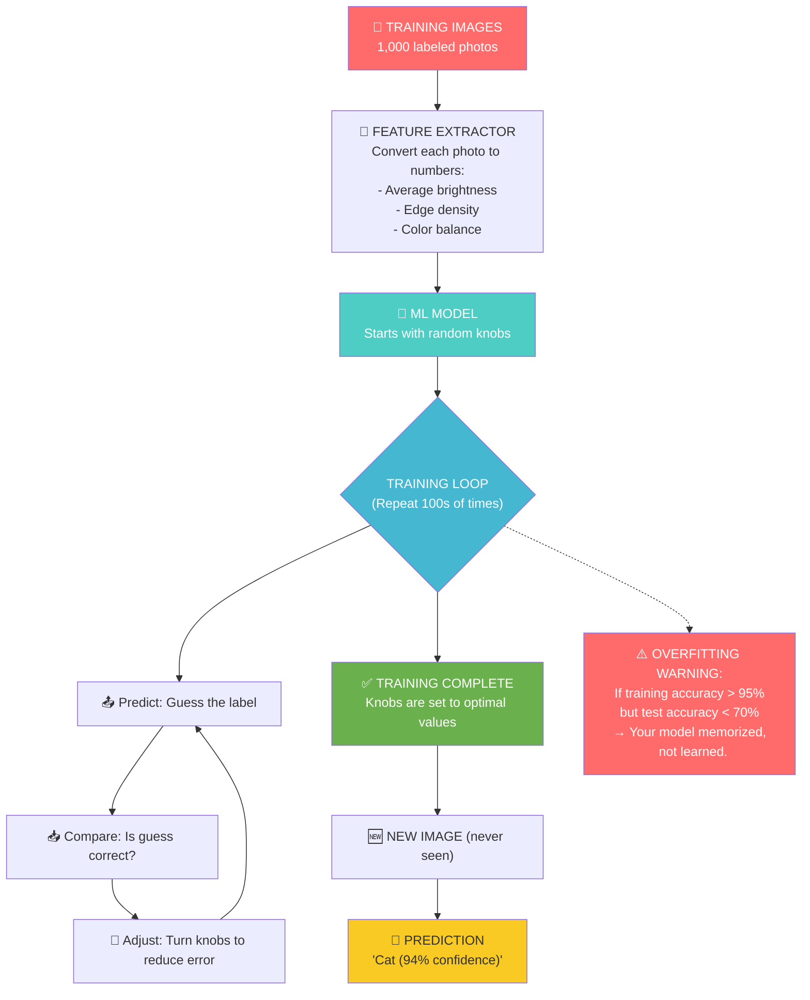

# Chapter 8: The Awakening

---

## Block 1: The Philosophical Hook

**"How do you know you've learned something?"**

Think about learning to ride a bike. Did you learn by reading a textbook? By someone explaining torque and balance? No. You got on the bike. You fell. You got up. You fell again. Then suddenly — you didn't fall. You were riding.

Your brain made millions of tiny adjustments without you consciously directing any of them. You couldn't explain HOW you did it. But you could DO it.

**This is exactly how machine learning works.** The computer doesn't understand what it's doing. It can't explain its reasoning. But after seeing enough examples and making enough mistakes, it starts getting the right answer — without ever knowing WHY.

This gap between "being right" and "understanding" is the most philosophically disturbing thing about AI. And it's also the most useful.

In this chapter, your computer will **learn** for the first time. Not from rules you write — from examples it studies.

---

## Block 2: What We Need to Know (Zero-Math Core)

### The "Student Studying for an Exam" Analogy

Machine learning is exactly like a student preparing for a final exam:

| ML Concept | Student Analogy |
|---|---|
| **Training data** | Textbook and class notes |
| **Features** | Key topics to study (dates, formulas, names) |
| **Model** | The student's understanding |
| **Training** | Studying the textbook |
| **Validation** | Practice quiz (check progress, not graded) |
| **Testing** | Final exam (graded, only once) |
| **Overfitting** | Memorized the answers instead of learning the concept |
| **Underfitting** | Didn't study enough |
| **Good fit** | Understands the material, can answer new questions |

### The "Knobs" Analogy

Imagine a radio. You turn a knob — the volume changes. You turn another — the frequency changes. Each knob controls something.

A machine learning model has **thousands of internal knobs** (parameters). During training, the model does this:

1. Look at an image. Guess what it is (random guess at first).
2. Check the correct answer.
3. If wrong, **adjust some knobs** so the guess gets closer next time.
4. Repeat for thousands of images.
5. After enough adjustments, the knobs are set perfectly — the model can now guess correctly.

```text
Random knobs → Wrong guess → Adjust knobs → Better guess
    ↓           (compare        ↑
    Start        with truth)    Repeat 10,000 times
    ↓                            ↓
Final knobs → Correct guess → The AI has "learned"
```

### Overfitting: The "Cramming" Disaster

**Overfitting** is when the student memorizes the textbook word-for-word but can't answer a question phrased slightly differently.

In image terms:
- Training: AI sees 100 cat photos. All cats are orange.
- What it learns: "Orange furry = cat."
- Test: You show it a black cat.
- Prediction: "Not a cat" (wrong!)

**The fix:** Use **data augmentation** — artificially create variations of training images (flip, rotate, change brightness) so the AI can't just memorize. Make it learn the real pattern.

### Underfitting: The "Didn't Study" Problem

**Underfitting** is when the student skimmed the textbook once and got 40% on the exam.

In image terms:
- The AI doesn't look at enough details. It makes a rough guess: "pointy ears? must be cat."
- It misses subtle but important features: whisker patterns, eye shape, fur texture.

**The fix:** Train longer, use more features, or use a more powerful model.

### The Goldilocks Principle

```text
Underfitting ← → Perfect Fit ← → Overfitting
(Too simple)    (Just right)      (Too complex)
```

You want your model somewhere in the middle: complex enough to learn the pattern, but not so complex that it memorizes the noise.

---

## Block 3: The Tech Lab (Code & Usage)

Open the companion notebook `08_awakening.ipynb` in Colab.

### 8A: What is "Training" Really? — A Simplified Demo

```python
# We'll create a very simple dataset to visualize how ML works.
# Imagine 2 types of fruits: apples (red) and blueberries (blue).
# We'll plot them by their "redness" and "blueness" features.

import numpy as np
import matplotlib.pyplot as plt
from sklearn.neighbors import KNeighborsClassifier  # A simple "voting" classifier.

# Create synthetic fruit data.
# Each fruit has 2 features: redness (0-10) and blueness (0-10).

# Apples: high redness (7-10), low blueness (0-3)
apples_red = np.random.uniform(7, 10, 20)
apples_blue = np.random.uniform(0, 3, 20)

# Blueberries: low redness (0-3), high blueness (7-10)
blueberries_red = np.random.uniform(0, 3, 20)
blueberries_blue = np.random.uniform(7, 10, 20)

# Combine into feature array.
X = np.zeros((40, 2))
X[:20, 0] = apples_red      # First 20 = apples, Red feature.
X[:20, 1] = apples_blue     # First 20 = apples, Blue feature.
X[20:, 0] = blueberries_red # Last 20 = blueberries, Red feature.
X[20:, 1] = blueberries_blue # Last 20 = blueberries, Blue feature.

# Labels: 0 = apple, 1 = blueberry.
y = np.zeros(40)
y[20:] = 1

# Plot the data.
plt.figure(figsize=(6, 6))
plt.scatter(X[:20, 0], X[:20, 1], color='red', label='Apple', s=100)
plt.scatter(X[20:, 0], X[20:, 1], color='blue', label='Blueberry', s=100)
plt.xlabel("Redness")
plt.ylabel("Blueness")
plt.title("Fruit Dataset: Apples vs Blueberries")
plt.legend()
plt.grid(True)
plt.show()

print("Red apples are in the top-left (high red, low blue).")
print("Blueberries are in the bottom-right (low red, high blue).")
```

### 8B: Training a Classifier (The "First Learning" Moment)

```python
# KNN (K-Nearest Neighbors) is the simplest learning algorithm.
# How it works: "Show me your 3 nearest neighbors. Whatever they are, you are."
# n_neighbors=3 means: look at the 3 closest points and take a vote.

model = KNeighborsClassifier(n_neighbors=3)

# .fit() is the training step! This is where the model "learns."
# We pass it the features (X) and the correct labels (y).
model.fit(X, y)

print("Training complete! The model has learned the fruit pattern.")
```

### 8C: Making a Prediction

```python
# Now let's test the model on a NEW fruit it has NEVER seen.
# Imagine a fruit with redness=8 and blueness=2.

new_fruit = np.array([[8, 2]])  # Redness=8, Blueness=2.

# .predict() asks the model: "What do you think this is?"
prediction = model.predict(new_fruit)

if prediction[0] == 0:
    print("Prediction: This is an APPLE! (redness=8, blueness=2)")
else:
    print("Prediction: This is a BLUEBERRY! (redness=8, blueness=2)")

# .predict_proba() shows the model's confidence.
confidence = model.predict_proba(new_fruit)
print(f"Confidence: Apple={confidence[0][0]:.1%}, Blueberry={confidence[0][1]:.1%}")
```

### 8D: Visualizing the Decision Boundary

```python
# This visualizes what the model "thinks" the space looks like.
# It colors every possible (redness, blueness) combination as either apple or blueberry.

# Create a dense grid of points covering the feature space.
xx, yy = np.meshgrid(np.arange(0, 11, 0.1), np.arange(0, 11, 0.1))
grid_points = np.c_[xx.ravel(), yy.ravel()]

# Predict for every point in the grid.
grid_pred = model.predict(grid_points)

# Plot the decision regions.
plt.figure(figsize=(8, 6))
plt.contourf(xx, yy, grid_pred.reshape(xx.shape), alpha=0.3, cmap='RdBu')
plt.scatter(X[:20, 0], X[:20, 1], color='red', label='Apple', s=80, edgecolors='black')
plt.scatter(X[20:, 0], X[20:, 1], color='blue', label='Blueberry', s=80, edgecolors='black')
plt.scatter(new_fruit[0, 0], new_fruit[0, 1], color='green', s=200,
            marker='*', label='New Fruit', edgecolors='black')
plt.xlabel("Redness")
plt.ylabel("Blueness")
plt.title("Decision Boundary: How the Model 'Sees' the Fruit World")
plt.legend()
plt.grid(True, alpha=0.3)
plt.show()

print("The colored region shows what the model would predict for ANY fruit.")
print("Red region = 'Apple', Blue region = 'Blueberry'.")
```

### 8E: Overfitting Demo — Too Many Neighbors vs Too Few

```python
# With KNN, n_neighbors controls the complexity.
# n_neighbors=1: looks at ONLY the closest point → OVERFITTING.
# n_neighbors=30: looks at too many points → UNDERFITTING.
# n_neighbors=5: Goldilocks zone → GOOD FIT.

plt.figure(figsize=(15, 4))

for i, k in enumerate([1, 5, 30]):
    knn = KNeighborsClassifier(n_neighbors=k)
    knn.fit(X, y)
    grid_pred = knn.predict(grid_points)

    plt.subplot(1, 3, i + 1)
    plt.contourf(xx, yy, grid_pred.reshape(xx.shape), alpha=0.3, cmap='RdBu')
    plt.scatter(X[:20, 0], X[:20, 1], color='red', s=30)
    plt.scatter(X[20:, 0], X[20:, 1], color='blue', s=30)
    plt.title(f"k = {k}")
    plt.xlabel("Redness")
    plt.ylabel("Blueness")
    plt.grid(True, alpha=0.3)

plt.suptitle("Overfitting (k=1)  vs  Good Fit (k=5)  vs  Underfitting (k=30)", fontsize=14)
plt.tight_layout()
plt.show()

print("k=1: The boundary is very wiggly — it memorized every point (OVERFITTING).")
print("k=5: Smooth boundary that captures the real pattern (GOOD FIT).")
print("k=30: Too smooth — it misses details (UNDERFITTING).")
```

### 8F: Applying ML to Real Images (Features from Images)

```python
# Let's extract simple features from images and classify them.
# We'll use our cats vs dogs dataset from Chapter 7.

import os
from skimage import color, filters  # For image feature extraction.

# If you downloaded the cats/dogs dataset in Ch7, use it.
# Otherwise, let's create simple features from uploaded images.

print("Upload 3 cat images and 3 dog images:")
uploaded = files.upload()

# Extract features: for each image, compute:
# Feature 1: Average brightness.
# Feature 2: Edge density (how many edges per pixel).
# Feature 3: Average red channel.

features = []
labels = []

for filename in uploaded.keys():
    img_bgr = cv.imread(filename)
    img_rgb = cv.cvtColor(img_bgr, cv.COLOR_BGR2RGB)
    img_gray = cv.cvtColor(img_bgr, cv.COLOR_BGR2GRAY)

    # Feature 1: Average brightness (0-255).
    avg_brightness = np.mean(img_gray)

    # Feature 2: Edge density.
    edges = cv.Canny(img_gray, 50, 150)
    edge_density = np.sum(edges > 0) / edges.size

    # Feature 3: Average red.
    avg_red = np.mean(img_rgb[:, :, 0])

    features.append([avg_brightness, edge_density * 100, avg_red])
    print(f"{filename}: Brightness={avg_brightness:.0f}, Edges={edge_density:.2%}, Red={avg_red:.0f}")

# For this demo, you'll need to tell the model which is which.
input("\nPress Enter when you're ready to label them manually...")
print("\nThis is called 'labeling' — every data scientist does this.")
```

---

## Block 4: The Family Mirror

### How This Chapter Helps Your Father

Your father's email spam filter is a machine learning model. It was trained on thousands of emails labeled "spam" and "not spam." It extracted features like "contains the word 'free'" and "sender is unknown."

When a new email arrives, the model doesn't ask "is this spam?" — it asks "how similar is this email to the spam emails I've seen?" That's **KNN working at scale.**

### How This Chapter Helps Your Mother

Your mother's **health/fitness tracker** uses ML to detect sleep patterns. It was trained on data from thousands of people wearing the device while sleeping, with features like "heart rate variability" and "movement frequency."

The model learned a pattern: "low movement + low heart rate = deep sleep." It didn't need a doctor to explain sleep stages. It just needed the data.

---

## Block 5: Cognitive Debugging (Issues & Solutions)

### The Mistake: "My model got 99% on training but 55% on testing — it's broken."

**Why it happens:** You've overfitted. The model memorized the training data. In the Fruit example, k=1 gives 100% training accuracy but would fail on new fruits that aren't exactly like the training ones.

**The psychological fix:** This is like a student who aced the practice test because the questions were identical to the homework... but failed the real exam. The solution: use a validation set to detect overfitting early.

### The Mistake: "I tried more neighbors and the accuracy went down."

**Why it happens:** You underfitted. Too many neighbors smoothed away the real pattern. Like a student who studied so broadly they missed the details.

**The fix:** Use validation accuracy to find the sweet spot. Plot training accuracy vs validation accuracy — when they diverge, you're overfitting.

### The Mistake: "I normalized my images but the model got worse."

**Why it happens:** You might have normalized incorrectly. Image values (0-255) are already in a reasonable range. If you transformed them to 0-1 and the model expected 0-255, confusion happens.

**The fix:** Always check: what range does my model expect? KNN works better when features are on similar scales, but you have to do it correctly.

---

## Block 6: The AI Assistant Prompt

> You are an encouraging ML tutor for a college freshman who knows zero math. We just learned that machine learning is about adjusting knobs based on examples, and that overfitting is like memorizing instead of understanding. Please:
> 1. Test my understanding: "Explain the difference between training accuracy and validation accuracy using the student exam analogy."
> 2. Give me a puzzle: "Imagine you train a cat/dog classifier using only black-and-white photos. What happens when you test it on color photos? Is that overfitting or something else?"
> 3. Explain "data augmentation" (flipping, rotating images) and why it prevents overfitting. Use the analogy of studying from different textbooks instead of the same one.
> 4. Ask me: "If your model is 99% accurate on training but 50% on testing, what's the first thing you should try?"
> 5. Be warm. Tell me that even Google engineers deal with overfitting daily.

---

## Block 7: The Brain-Tickler (Funny Exercise)

### The "Overfitted Morning" Challenge (Advanced)

Create a dataset of photos of your face with two expressions: "Tired" (before coffee) and "Awake" (after coffee).

1. Take 5 photos of each expression.
2. Extract features: average brightness (tired faces tend to be darker under eyes), edge density (tired faces have fewer sharp edges?), and average red.
3. Train a KNN classifier to distinguish tired vs awake.
4. Test it on a NEW photo of each expression.
5. If it fails — laugh, and realize that 5 photos per class is way too few for real ML.

```python
# The "Coffee Detection" model starter:
# Extract features for each photo.
tired_features = []
awake_features = []

# ... (fill in with your photos)

model = KNeighborsClassifier(n_neighbors=2)
# X = tired_features + awake_features
# y = [0, 0, 0, 0, 0, 1, 1, 1, 1, 1]
# model.fit(X, y)
# Test on new photo.
```

**If your model can detect tiredness, name it "The Coffee Oracle" and use it to decide when you need caffeine.**

---

## Block 8: Visual Infographic Blueprint



**Title:** "How a Machine Learns — The Training Loop"
**Caption:** The AI doesn't "understand" anything. It starts with random guesses, compares them to the correct answer, adjusts its internal knobs, and repeats thousands of times. The result: a model that can predict correctly without ever knowing WHY.

---

## Block 9: The Mentor's Feedback

This was the big one. The chapter where the machine wakes up.

Here's what you accomplished:
- You understood what machine learning actually IS (pattern finding, not magic).
- You learned the training loop: predict → compare → adjust → repeat.
- You trained your first classifier (KNN) on a fruit dataset.
- You visualized the decision boundary — seeing what the model "thinks."
- You experienced overfitting vs underfitting firsthand.
- You extracted real image features and set up an image classifier.
- You learned that overfitting is just "memorizing the answers" — a very human mistake.

**Here's the truth that will put you ahead of most beginners:** Machine learning is NOT about complex math. It's about:
1. Good data (lots of it, well-organized).
2. Good features (the right numbers to look at).
3. A model that's complex enough but not too complex.
4. Detecting overfitting early.

That's it. Everything else is engineering.

**Your AI is no longer a rule-follower. It's a pattern-finder. It's awake.**

When you're ready to build something real, say **PROCEED** and we'll enter Chapter 9: The Masterpiece — your first complete Computer Vision project.

---

*— A.L Hossam A. Abdelwahab*
