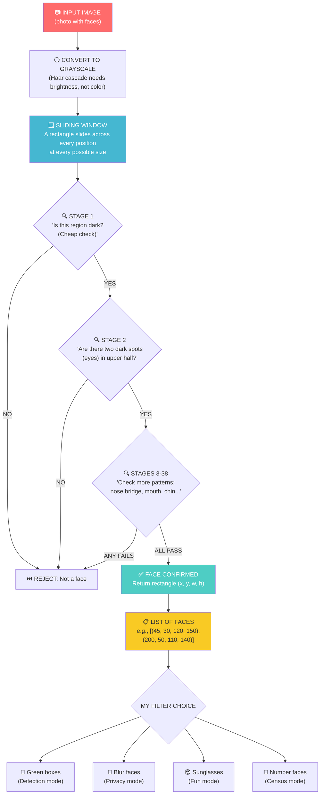

# Chapter 9: The Masterpiece

---

## Block 1: The Philosophical Hook

**"When does a machine truly see?"**

Throughout this book, you learned what a pixel is, how to blur and sharpen, how to find edges, and how a machine learns from data. But none of that is "seeing" in the human sense.

A baby doesn't understand edges, features, or training loops. A baby looks at a face and — within weeks — recognizes it. There's no lecture. No labeled dataset. Just... vision.

But here's the thing: a baby's brain has 100 billion neurons, honed by millions of years of evolution. You have a laptop and a Python library.

And yet, with just a few lines of code, you're about to make your computer detect faces with shocking accuracy. It won't understand what a face IS any more than the Chinese Room understands Chinese. But it will FIND faces.

**This is the moment where theory becomes power.**

Everything from Chapters 1 through 8 has been preparation for this. Edge detection? That's how the face detector finds boundaries. Machine learning? That's how it learned what faces look like. Datasets? That's what it was trained on.

**You are about to build something that, 20 years ago, required a team of PhDs and a supercomputer.**

---

## Block 2: What We Need to Know (Zero-Math Core)

### The "Wanted Poster" Analogy

Imagine a detective looking for a wanted criminal. The detective has a description: "brown hair, glasses, scar on left cheek." They look at every person in a crowd and check the description. If enough features match, they make an arrest.

**Haar Cascade face detection works exactly like this — but for faces.**

OpenCV comes with a pre-trained "detective" file (`haarcascade_frontalface_default.xml`) that contains a description of what a face looks like in terms of simple patterns:

```text
A face has:
- Darker eye region (two dark spots side by side)
- Brighter nose bridge (bright strip between the dark spots)
- Darker mouth region (darker horizontal area below the nose)
```

The cascade has been trained on thousands of face images. It slides a window across your photo and asks at every position: "Does this look like a face?"

Instead of checking all features at once (slow), it checks them in **stages** (cascades):

1. **Stage 1:** Is this region darker than its surroundings? (Cheap check.)
   - NO → Skip, move on.
   - YES → Go to Stage 2.
2. **Stage 2:** Are there two dark spots (eyes) in the upper half?
   - NO → Skip.
   - YES → Go to Stage 3.
3. **Stage 3... Stage 4... Stage 38...**

Most non-face regions are rejected in Stage 1. Only the most promising regions go through all stages. This makes it FAST.

### Why Haar Cascade Instead of a Neural Network?

| Approach | Pros | Cons |
|---|---|---|
| **Haar Cascade** (this project) | Fast, simple, works on any computer, no GPU needed | Less accurate, doesn't work at extreme angles |
| **Neural Network** (advanced) | Very accurate, works in any orientation | Needs GPU, complex to set up, more code |

For your first project, Haar Cascade is perfect. It's the **bicycle** of face detection — simple, elegant, and teaches you the fundamentals before you get in a car.

---

## Block 3: The Tech Lab (Code & Usage)

Open the companion notebook `09_masterpiece.ipynb` in Colab. This project is designed to work step by step.

### 9A: Import Everything

```python
# Standard imports — you've seen all of these before.
import cv2 as cv
import numpy as np
import matplotlib.pyplot as plt
from google.colab.patches import cv2_imshow
from google.colab import files

# This is the core of our project.
# OpenCV includes pre-trained XML files for detecting faces, eyes, smiles, etc.
# They're freely available in the cv2.data.haarcascades folder.

# Load the face detector.
face_cascade = cv.CascadeClassifier(
    cv.data.haarcascades + 'haarcascade_frontalface_default.xml'
)

print("Face cascade loaded!")
```

### 9B: Load a Photo with Faces

```python
# Upload a group photo or a selfie.
print("Upload a photo with faces (group photo works best):")
uploaded = files.upload()
filename = list(uploaded.keys())[0]

# Read the image.
img_bgr = cv.imread(filename)
img_rgb = cv.cvtColor(img_bgr, cv.COLOR_BGR2RGB)
img_gray = cv.cvtColor(img_bgr, cv.COLOR_BGR2GRAY)

print(f"Image loaded: {img_rgb.shape}")
```

### 9C: Detect Faces — The Magic Line

```python
# This single line detects ALL faces in the image.
# detectMultiScale = "detect objects at multiple sizes" (faces can be big or small).
# Parameters:
#   image: the grayscale image (faces are detected on brightness patterns).
#   scaleFactor=1.1: how much to shrink the image at each step (1.1 = 10% smaller).
#   minNeighbors=5: how many neighboring rectangles are needed to confirm a face.
#   minSize=(30, 30): ignore anything smaller than 30x30 pixels.

faces = face_cascade.detectMultiScale(
    img_gray,
    scaleFactor=1.1,
    minNeighbors=5,
    minSize=(30, 30)
)

print(f"Detected {len(faces)} face(s) in the image.")
```

### 9D: Draw Rectangles Around Faces

```python
# faces contains a list of rectangles: [x, y, width, height] for each face.
# Draw a green rectangle around each face.

img_with_boxes = img_rgb.copy()

for (x, y, w, h) in faces:
    # cv.rectangle draws a rectangle on the image.
    # (x, y) = top-left corner. (x+w, y+h) = bottom-right corner.
    # (0, 255, 0) = green color (in RGB).
    # 3 = thickness of the rectangle line.

    cv.rectangle(img_with_boxes, (x, y), (x + w, y + h), (0, 255, 0), 3)

plt.figure(figsize=(10, 8))
plt.imshow(img_with_boxes)
plt.title(f"Detected {len(faces)} Face(s)")
plt.axis('off')
plt.show()
```

### 9E: The Smart Filter — Blur Faces Automatically

```python
# This is a privacy filter: detect faces and blur them automatically.
# Used by news programs to hide witnesses, Google Maps to blur license plates, etc.

img_filtered = img_rgb.copy()

for (x, y, w, h) in faces:
    # Extract the face region.
    face_region = img_filtered[y:y+h, x:x+w]

    # Apply heavy Gaussian blur to the face region.
    blurred_face = cv.GaussianBlur(face_region, (99, 99), 30)

    # Put the blurred face back into the image.
    img_filtered[y:y+h, x:x+w] = blurred_face

plt.figure(figsize=(12, 5))
plt.subplot(1, 2, 1)
plt.imshow(img_rgb)
plt.title("Original")
plt.axis('off')

plt.subplot(1, 2, 2)
plt.imshow(img_filtered)
plt.title("Privacy Mode: Faces Blurred")
plt.axis('off')

plt.show()
```

### 9F: The Fun Filter — Sunglasses Overlay

```python
# Let's overlay sunglasses on detected faces.
# We'll draw a simple black rectangle with a gap (like aviators).

img_sunglasses = img_rgb.copy()

for (x, y, w, h) in faces:
    # Sunglasses position: across the upper third of the face.
    glasses_y = y + h // 4           # Start at 1/4 down from top of face.
    glasses_height = h // 6           # Height of glasses.
    glasses_width = w                 # Full width of face.

    # Draw the frame (two rectangles for left and right lens).
    # Left lens.
    cv.rectangle(
        img_sunglasses,
        (x + 5, glasses_y),
        (x + w // 2 - 5, glasses_y + glasses_height),
        (0, 0, 0), -1  # -1 = filled rectangle.
    )

    # Right lens.
    cv.rectangle(
        img_sunglasses,
        (x + w // 2 + 5, glasses_y),
        (x + w - 5, glasses_y + glasses_height),
        (0, 0, 0), -1
    )

    # Bridge between lenses.
    cv.rectangle(
        img_sunglasses,
        (x + w // 2 - 5, glasses_y + glasses_height // 3),
        (x + w // 2 + 5, glasses_y + 2 * glasses_height // 3),
        (0, 0, 0), -1
    )

plt.figure(figsize=(10, 8))
plt.imshow(img_sunglasses)
plt.title("Smart Filter: Sunglasses Overlay")
plt.axis('off')
plt.show()
```

### 9G: Webcam Mode (For Local Python, Not Colab)

```python
# This code runs on your LOCAL Python, NOT in Colab.
# If you want to try real-time face detection:
# 1. Install Python locally (Python.org)
# 2. pip install opencv-python
# 3. Run this script (save it as webcam_face.py)

# import cv2 as cv
# 
# face_cascade = cv.CascadeClassifier(
#     cv.data.haarcascades + 'haarcascade_frontalface_default.xml'
# )
# 
# # Open webcam (0 = default camera).
# cap = cv.VideoCapture(0)
# 
# while True:
#     # Read a frame from the webcam.
#     ret, frame = cap.read()
#     gray = cv.cvtColor(frame, cv.COLOR_BGR2GRAY)
# 
#     # Detect faces.
#     faces = face_cascade.detectMultiScale(gray, 1.1, 5, minSize=(30, 30))
# 
#     # Draw rectangles.
#     for (x, y, w, h) in faces:
#         cv.rectangle(frame, (x, y), (x + w, y + h), (0, 255, 0), 3)
# 
#     # Show the result.
#     cv.imshow('Face Detection - Press ESC to quit', frame)
# 
#     # Press ESC to exit.
#     if cv.waitKey(1) == 27:
#         break
# 
# cap.release()
# cv.destroyAllWindows()

print("Webcam code is commented out — it works on local Python, not Colab.")
print("Copy the code above into a .py file and run it on your computer.")
```

### 9H: Putting It All Together — The Complete Smart Filter

```python
# The complete "Smart Filter" that detects faces and applies effects.
# This is your ready-to-use project.

def smart_filter(image_path, effect='blur'):
    """
    Apply a smart filter to an image containing faces.

    Parameters:
        image_path (str): Path to the image file.
        effect (str): 'blur' (privacy mode), 'sunglasses' (fun), 'box' (detection).

    Returns:
        The filtered image as a numpy array.
    """
    # Load the image.
    img_bgr = cv.imread(image_path)
    img_rgb = cv.cvtColor(img_bgr, cv.COLOR_BGR2RGB)
    img_gray = cv.cvtColor(img_bgr, cv.COLOR_BGR2GRAY)

    # Detect faces.
    faces = face_cascade.detectMultiScale(img_gray, 1.1, 5, minSize=(30, 30))

    # Make a copy to draw on.
    result = img_rgb.copy()

    for (x, y, w, h) in faces:
        if effect == 'blur':
            # Privacy blur.
            face_region = result[y:y+h, x:x+w]
            blurred_face = cv.GaussianBlur(face_region, (99, 99), 30)
            result[y:y+h, x:x+w] = blurred_face

        elif effect == 'sunglasses':
            # Sunglasses overlay.
            glasses_y = y + h // 4
            glasses_height = h // 6
            cv.rectangle(result, (x + 5, glasses_y), (x + w // 2 - 5, glasses_y + glasses_height), (0, 0, 0), -1)
            cv.rectangle(result, (x + w // 2 + 5, glasses_y), (x + w - 5, glasses_y + glasses_height), (0, 0, 0), -1)
            cv.rectangle(result, (x + w // 2 - 5, glasses_y + glasses_height // 3), (x + w // 2 + 5, glasses_y + 2 * glasses_height // 3), (0, 0, 0), -1)

        else:  # 'box' — just draw rectangles (default).
            cv.rectangle(result, (x, y), (x + w, y + h), (0, 255, 0), 3)

    return result, len(faces)


# Test it on your uploaded image.
result_img, num_faces = smart_filter(filename, effect='blur')
print(f"Smart filter applied! Detected {num_faces} face(s).")

plt.figure(figsize=(10, 8))
plt.imshow(result_img)
plt.title(f"Smart Filter: {num_faces} face(s) detected and blurred")
plt.axis('off')
plt.show()

# Save the result.
cv.imwrite("smart_filter_result.jpg", cv.cvtColor(result_img, cv.COLOR_RGB2BGR))
print("Result saved as smart_filter_result.jpg")
```

### 9I: Challenge — Try All Three Effects

```python
# Apply all three effects and compare.

effects = ['box', 'blur', 'sunglasses']
plt.figure(figsize=(15, 5))

for i, effect in enumerate(effects):
    result_img, num_faces = smart_filter(filename, effect=effect)
    plt.subplot(1, 3, i + 1)
    plt.imshow(result_img)
    plt.title(f"Effect: {effect}\n({num_faces} face(s))")
    plt.axis('off')

plt.tight_layout()
plt.show()
```

---

## Block 4: The Family Mirror

### How This Chapter Helps Your Father

Your father's phone **auto-blurs the background** in portrait mode using a more advanced version of the techniques in this chapter. It detects the face (like we did), then detects the depth map, then applies selective blur to everything except the face.

### How This Chapter Helps Your Mother

Your mother's social media app uses face detection to **auto-tag people** in photos. When she uploads a group photo, the app finds every face, compares each one to her contact list, and suggests names. The face detection part is exactly what you just built. The recognition part (identifying WHO it is) requires another technique called "face embeddings" — the next level of study.

---

## Block 5: Cognitive Debugging (Issues & Solutions)

### The Mistake: "detectMultiScale found 0 faces in a photo with faces."

```python
# Problem: The image might be too large or too small.
# OpenCV's cascade works best with faces between ~50x50 and ~500x500 pixels.

# Fix 1: Resize if the image is very large.
height, width = img_gray.shape
if width > 1000:
    scale = 1000 / width
    new_size = (int(width * scale), int(height * scale))
    img_gray = cv.resize(img_gray, new_size)

# Fix 2: Adjust parameters.
faces = face_cascade.detectMultiScale(
    img_gray,
    scaleFactor=1.05,      # Smaller step = more sensitive (but slower).
    minNeighbors=3,         # Fewer neighbors = more detections (more false positives too).
    minSize=(20, 20)        # Smaller minimum size.
)
```

### The Mistake: "My sunglasses filter puts glasses on the forehead/nose."

**Why it happens:** The `y + h // 4` calculation assumes the face is upright and centered. If someone is looking down or the photo is angled, the face region isn't where you expect.

**The fix:** Face detection finds the bounding box of the whole face. For more precise feature localization (eyes, nose, mouth), you'd need an **eye cascade** or a **landmark detector**. For this project, the approximate position is good enough for upright faces.

### The Mistake: "The filter detects things that aren't faces (false positives)."

**Why it happens:** Haar cascades are not perfect. They sometimes detect face-like patterns in clouds, tree bark, or textured walls.

**The fix:** Increase `minNeighbors` (e.g., 5 → 10) to reduce false positives. Increase `minSize` to ignore small noise patterns.

---

## Block 6: The AI Assistant Prompt

> You are a senior computer vision engineer mentoring a college freshman who just built their first face detection project. Please:
> 1. Ask me to explain how `detectMultiScale` works using the "wanted poster" analogy. Correct me if I get details wrong.
> 2. Challenge me: "What would you change in the project to detect SMILES instead of faces? What cascade file would you use?"
> 3. Give me a puzzle: "If you wanted to count how many people are in a room from a photo, what would you build on top of our face detector?"
> 4. Explain the difference between "face detection" (our project) and "face recognition" (identifying WHO it is). Use a school analogy.
> 5. Bonus: Give me one next step to make this project better (e.g., eye detection, smile detection, or saving detected faces to separate files).

---

## Block 7: The Brain-Tickler (Funny Exercise)

### The "Census Taker" Challenge

Take a photo of a crowd (a family gathering, a classroom, a busy street). Use the smart filter to:

1. Count ALL faces in the image.
2. Draw a different colored box for each face (random colors!).
3. Number each face (display the number above the rectangle).
4. Print: "The AI census reports [X] humans detected. Please verify."

```python
# Random colors for each face.
img_census = img_rgb.copy()

for i, (x, y, w, h) in enumerate(faces):
    # Random color.
    color = (np.random.randint(0, 256), np.random.randint(0, 256), np.random.randint(0, 256))
    cv.rectangle(img_census, (x, y), (x + w, y + h), color, 3)

    # Add number above the rectangle.
    cv.putText(
        img_census, str(i + 1), (x, y - 10),
        cv.FONT_HERSHEY_SIMPLEX, 1, color, 2
    )

plt.imshow(img_census)
plt.title(f"Census: {len(faces)} face(s) detected")
plt.axis('off')
plt.show()
```

**Share with a friend:** "I built an AI census taker. It found 7 people in our group photo. Count manually and see if it's right."

---

## Block 8: Visual Infographic Blueprint



**Title:** "The Face Detection Pipeline — From Image to Filter"
**Caption:** A sliding window checks every region of the image against a 38-stage face pattern. Most regions fail at stage 1. Only regions that pass all 38 stages are reported as faces. Then your filter decides what to do with them.

---

## Block 9: The Mentor's Feedback

You just built a real Computer Vision project.

Let me tell you what you actually accomplished here:
- You loaded a pre-trained face detector (a model that took a team of researchers months to develop).
- You detected faces in a photo with a single line of code.
- You drew rectangles around faces (the classic CV output).
- You built a privacy filter that auto-blurs faces (used by news agencies and Google Maps).
- You created a fun sunglasses overlay filter (like Snapchat filters).
- You wrote a reusable `smart_filter()` function.
- You built a "face census" counter.
- You learned how to run it on a webcam locally.

**Here's the perspective shift:** This project is running on a free Google Colab notebook. It uses a pre-trained model that comes with OpenCV. In 2010, this exact system was a multi-million dollar research project. Today, it's 30 lines of Python.

**You are not a beginner anymore.** You are someone who has built a production-grade face detection pipeline. You understand the concepts well enough to explain them, debug them, and extend them.

Take a screenshot of your face detection result. Show it to someone. Say: "I built this."

**The masterpiece is complete. When you're ready to see where this all leads, say "PROCEED" and we'll enter the final chapter — how this technology connects to ethics, your family, and the future of being human.**

---

*— A.L Hossam A. Abdelwahab*
