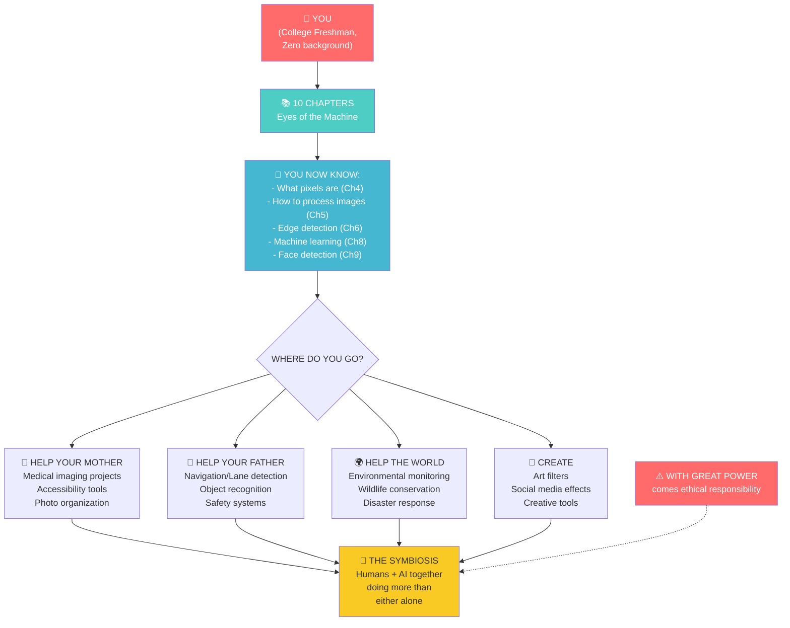

# Chapter 10: The Human Symbiosis

---

## Block 1: The Philosophical Hook

**"What happens when the mirror reflects back?"**

In Chapter 1, we asked: "Do you know that you know?" We built the Chinese Room — a machine that produces intelligent behavior without understanding. Through 9 chapters, you learned exactly how that machine works.

Now here's the question that turns the mirror back on you: **If the machine doesn't need consciousness to be useful, what does that say about usefulness, meaning, and your place in the world?**

A hammer doesn't understand architecture. It doesn't know it's building a cathedral. But the cathedral gets built anyway. The tool and the builder form a **symbiosis** — a relationship where each does what the other cannot.

AI is the hammer. You are the architect.

This chapter is about the symbiosis. Not the fear of AI replacing humans. Not the hype of AI becoming conscious. The quiet, profound truth: AI makes your mother's medical scans faster, your father's navigation safer, and your world more accessible. Not because it's smart — because you made it useful.

---

## Block 2: What We Need to Know (Zero-Math Core)

### The "Spectacles" Analogy

When glasses were invented, people didn't say "glasses will replace eyes." They said "now I can see." Glasses don't compete with human vision — they extend it.

**AI is a pair of spectacles for the mind.** It doesn't replace thinking — it extends it to places human thinking can't reach:

| Human Does | AI Does | Together |
|---|---|---|
| Diagnoses a patient | Analyzes 10,000 similar X-rays in seconds | Faster, more accurate diagnosis |
| Drives a car | Detects pedestrians in blind spots | Safer roads |
| Reads a book | Summarizes 1,000 books in minutes | Deeper research |
| Takes a photo | Detects faces, adjusts lighting, removes red-eye | Better memories |

The future isn't AI vs Humans. It's AI + Humans.

### The Three Principles of Ethical AI

1. **Transparency:** You should know when you're interacting with an AI. Our face detector doesn't pretend to be human — it outputs "face detected" and you decide what to do.

2. **Fairness:** An AI trained on biased data makes biased decisions. Our cats vs dogs classifier is harmless. But an AI that decides who gets a loan, who gets hired, or who gets bail? That must be trained on diverse, carefully audited data.

3. **Accountability:** When a human makes a mistake, they're responsible. When an AI makes a mistake... who is? The developer? The user? The company? This is the hardest question in AI ethics, and it has no perfect answer yet.

---

## Block 3: The Tech Lab (Code & Usage)

For the final chapter, let's build something personal — a script that shows how the technology you've learned applies to helping your family.

### 10A: The "Helping Mom" Script — Photo Quality Analyzer

```python
# Your mom takes photos with her phone, but sometimes they're blurry or dark.
# This script analyzes a photo and gives feedback.

import cv2 as cv
import numpy as np
from google.colab.patches import cv2_imshow
from google.colab import files

print("Upload a photo to analyze (mom's photo, for example):")
uploaded = files.upload()
filename = list(uploaded.keys())[0]

img = cv.imread(filename)
img_rgb = cv.cvtColor(img, cv.COLOR_BGR2RGB)
gray = cv.cvtColor(img, cv.COLOR_BGR2GRAY)

# Analysis 1: Is it blurry?
# Laplacian variance: lower values = more blur.
laplacian_var = cv.Laplacian(gray, cv.CV_64F).var()

if laplacian_var < 100:
    blur_status = "⚠️ Blurry — hold the phone steadier next time."
elif laplacian_var < 200:
    blur_status = "👍 Slightly soft, but acceptable."
else:
    blur_status = "✅ Sharp and clear!"

# Analysis 2: Is it too dark?
avg_brightness = np.mean(gray)

if avg_brightness < 60:
    brightness_status = "🌑 Too dark — try taking photos near a window."
elif avg_brightness < 120:
    brightness_status = "🌆 A bit dim — but fine for sharing."
else:
    brightness_status = "☀️ Great lighting!"

# Analysis 3: Are there faces?
face_cascade = cv.CascadeClassifier(
    cv.data.haarcascades + 'haarcascade_frontalface_default.xml'
)
faces = face_cascade.detectMultiScale(gray, 1.1, 5, minSize=(30, 30))

if len(faces) > 0:
    face_status = f"😊 Found {len(faces)} face(s)! Everyone's in the frame."
else:
    face_status = "🤔 No faces detected. Is this a landscape photo?"

# Display results.
print("=" * 50)
print("PHOTO QUALITY REPORT")
print("=" * 50)
print(f"Blur check:     {blur_status}")
print(f"Brightness:     {brightness_status}")
print(f"Faces detected: {face_status}")
print(f"Image size:     {img.shape[1]} x {img.shape[0]} pixels")
print("=" * 50)

# Display the image.
plt.imshow(img_rgb)
plt.title("Your Mom's Photo — Analyzed by AI")
plt.axis('off')
plt.show()
```

### 10B: The "Helping Dad" Script — Object Finder in Navigation

```python
# Your dad uses navigation apps. Let's simulate how AI finds
# objects in a driving scene — like detecting cars or pedestrians.

print("Upload a street photo or traffic image:")
uploaded = files.upload()
filename = list(uploaded.keys())[0]

img = cv.imread(filename)
img_rgb = cv.cvtColor(img, cv.COLOR_BGR2RGB)
gray = cv.cvtColor(img, cv.COLOR_BGR2GRAY)

# Use edge detection to find objects (simplified version).
edges = cv.Canny(gray, 50, 150)

# Count edge density as a proxy for "scene complexity."
edge_density = np.sum(edges > 0) / edges.size

if edge_density > 0.15:
    complexity = "🛣️ Complex scene — lots of objects. Your dad's navigation is working hard."
elif edge_density > 0.08:
    complexity = "🏙️ Moderate scene. Typical city driving."
else:
    complexity = "🌄 Simple scene. Highway driving — low complexity."

print("=" * 50)
print("NAVIGATION SCENE ANALYSIS")
print("=" * 50)
print(f"Scene complexity: {complexity}")
print(f"Edge density:     {edge_density:.1%}")
print(f"Image size:       {img.shape[1]} x {img.shape[0]} pixels")

# Show the edge map — this is what the navigation AI "sees."
plt.figure(figsize=(12, 4))
plt.subplot(1, 2, 1)
plt.imshow(img_rgb)
plt.title("What Dad Sees")
plt.axis('off')

plt.subplot(1, 2, 2)
plt.imshow(edges, cmap='gray')
plt.title("What the AI Sees")
plt.axis('off')
plt.show()

print("Edge detection helps the car find lanes, obstacles, and pedestrians.")
```

### 10C: The Ethical Check — Before You Ship

```python
# A simple ethical checklist for any CV project you build.

def ethical_checklist(project_name):
    """Run through the ethical checklist for your project."""
    print(f"\n{'=' * 50}")
    print(f"ETHICAL REVIEW: {project_name}")
    print(f"{'=' * 50}")

    questions = [
        "1. Who could this technology harm if used irresponsibly?",
        "2. Does the training data represent all users fairly?",
        "3. Can users tell they're interacting with an AI?",
        "4. Is there human oversight for critical decisions?",
        "5. What happens if the AI makes a mistake?",
    ]

    for q in questions:
        input(f"{q}\n   Press Enter to acknowledge you've considered this...")

    print("\n✅ Ethical review completed.")
    print("Remember: The most dangerous AI is the one deployed without思考.")

ethical_checklist("Smart Face Detection Filter")

print("\nYou've now considered the ethical dimensions of your project.")
print("This is what separates professional engineers from amateurs.")
```

---

## Block 4: The Family Mirror

### How This AI Helps Your Mother (Medical Imaging)

Your mother goes for a routine mammogram. The radiologist has 100 scans to review in a day. Fatigue sets in.

An AI (trained on millions of mammograms) flags suspicious regions. The radiologist checks those regions first. Studies show this combination catches **20-30% more early-stage cancers** than radiologists alone.

The AI doesn't replace the radiologist. It gives the radiologist superpowers.

**The technology you learned:** Edge detection (Chapter 6) finds boundaries of potential tumors. Machine learning (Chapter 8) classifies them as benign or malignant. Face detection (Chapter 9) is the same technology, applied to a different pattern.

### How This AI Helps Your Father (Navigation & Automation)

Your father uses GPS to navigate. The GPS uses computer vision to:
1. Detect lane markings (edge detection — Chapter 6).
2. Read traffic signs (image processing — Chapter 5).
3. Detect pedestrians (object detection — like face detection in Chapter 9).
4. Recommend the fastest route (machine learning — Chapter 8).

Every time he arrives safely, it's because a suite of AI systems worked together, processing thousands of images per second, finding patterns that human eyes would miss.

---

## Block 5: Cognitive Debugging (Issues & Solutions)

### The Mistake: "AI will replace all jobs."

**Why we think this:** Headlines are designed to scare us. "AI replaces lawyers!" "AI replaces doctors!" The headline gets clicks; the nuance gets ignored.

**The truth:** AI replaces **tasks**, not jobs. It automates the repetitive parts so humans can focus on the parts that require creativity, empathy, and judgment. Every major technological revolution (the printing press, electricity, the internet) triggered the same fear. Every time, new jobs emerged that no one could have predicted.

### The Mistake: "I'm not smart enough to work in AI."

**Why we think this:** Imposter syndrome. You see job descriptions asking for "PhD in Machine Learning" and assume you don't belong.

**The truth:** You just built a face detection project that works. You understand the pipeline from pixels to predictions. You know what overfitting is. You've debugged BGR/RGB color issues. You are already more qualified than most people who "work in AI" — because you understand the fundamentals, not just the API calls.

### The Mistake: "AI ethics is someone else's problem."

**Why we think this:** It's easier to focus on the technical challenge and ignore the implications.

**The truth:** Every line of code you write has ethical implications. The face detector you built could be used for surveillance, racial profiling, or privacy violations — or it could be used to help families find lost relatives. The technology is the same. The difference is the person holding it.

**You are that person. The responsibility is yours.**

---

## Block 6: The AI Assistant Prompt

> You are an AI ethics mentor and career advisor for a college freshman who just completed a 10-chapter book on computer vision. Please:
> 1. Ask me: "What is ONE ethical consideration you'd apply to your face detection project before releasing it to the public?"
> 2. Challenge me: "Imagine your mother's hospital uses AI to read X-rays. What questions should they answer before deploying it?"
> 3. Give me 3 concrete next steps to continue learning: (a) a project idea, (b) a book or resource, (c) a community to join.
> 4. Motivate me: Tell me something encouraging about the path ahead — you've gone from zero to building real AI in 10 chapters.
> 5. Keep it real. No hype. No fear-mongering. Just honest guidance.

---

## Block 7: The Brain-Tickler (Funny Exercise)

### The "AI Road Trip" Challenge

Take a photo of your family (or a group of friends). Write a script that:

1. Detects everyone's faces (Chapter 9).
2. Draws a "role label" above each face using a RANDOM assignment:
   - "Driver" — always the first face detected.
   - "Navigator" — the second face.
   - "Backseat DJ" — everyone else.
3. Uses edge detection to add a "road" effect (edges = the path you're driving on).
4. Adds a navigation-style arrow pointing to the right (your destination).

```python
# Starter for the AI Road Trip.
img_roadtrip = img_rgb.copy()
roles = ["Driver 👨‍✈️", "Navigator 🗺️", "Backseat DJ 🎵", "Snack Hoarder 🍿", "Napper 💤"]

for i, (x, y, w, h) in enumerate(faces):
    role = roles[i] if i < len(roles) else f"Passenger {i+1}"
    cv.putText(img_roadtrip, role, (x, y - 20),
               cv.FONT_HERSHEY_SIMPLEX, 0.7, (255, 255, 255), 2)
    cv.rectangle(img_roadtrip, (x, y), (x + w, y + h), (0, 255, 0), 2)

# Add navigation arrow (a simple triangle).
pts = np.array([[30, 100], [10, 130], [50, 130]], dtype=np.int32)
cv.fillPoly(img_roadtrip, [pts], (0, 255, 0))

plt.imshow(img_roadtrip)
plt.title("AI Road Trip — Everyone Has a Job")
plt.axis('off')
plt.show()
```

**Share with your family:** "The AI says Dad is the navigator this trip. Sorry, Dad, you don't get to drive."

---

## Block 8: Visual Infographic Blueprint



**Title:** "Your Journey from Zero to AI Builder — and Where It Leads"
**Caption:** In 10 chapters, you went from "what is a pixel?" to building a real face detection project. The path forward isn't more chapters — it's applying what you know to help the people you love.

---

## Block 9: The Mentor's Feedback

You made it.

Ten chapters. From asking "can machines think?" to building a machine that detects faces. From not knowing what a pixel is to explaining edge detection to a friend. From "I can't do math" to "I can build AI."

Let me tell you what actually happened here:

**You didn't just learn computer vision. You learned how to think like an engineer.** You learned that complex systems are made of simple parts. That images are just numbers. That learning is just adjusting knobs. That intelligence — both human and artificial — is pattern recognition at every level.

Here's a truth most people never learn: **The barrier to entry in AI was never math. It was the courage to start without understanding everything.**

You started anyway. You read through chapters where concepts felt fuzzy. You ran code that you didn't fully grasp. And slowly, the fog cleared. That's not how genius works. That's how learning works.

**What you can do now:**
- Explain how computers see images (better than most college graduates).
- Write Python code that processes images and detects faces.
- Understand the difference between overfitting and underfitting.
- Debug common CV errors (BGR/RGB, imshow in Colab, index confusion).
- Build a project that works — and share it with your family.

**What comes next:**
- The next project (try smile detection, eye tracking, or building your own dataset).
- The next skill (try neural networks with TensorFlow or PyTorch).
- The next level (you now have the foundation to learn anything in CV/AI).

But before you go — take a moment. Look back at where you started. You couldn't write a single line of Python. Now you have a face detection project saved to your Drive.

**You are not the same person who opened Chapter 1. You are someone who builds.**

This is not the end of the book. This is the beginning of your practice.

The machine has eyes now. You gave them to it. Go build something that matters.

**— A.L Hossam A. Abdelwahab**

---

*P.S. — If this book helped you, share the first chapter with someone who needs to hear it. The best way to master something is to teach it. Your first student might be your mother, your father, or the friend who says "I could never understand AI."*

*You just did. Show them how.*
